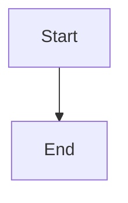

# AI & Development Tools

Comprehensive guide to AI-assisted development with Claude Code and essential development tools for this project.

---

## Overview

This project is optimized for AI-assisted development, with comprehensive context files and documentation that enable AI coding assistants to understand the architecture and make informed decisions.

---

## Claude Code Integration

### CLAUDE.md Context File

The `CLAUDE.md` file at the project root provides AI assistants with essential context about:

- Project architecture and tech stack
- Development commands and workflows
- File structure and naming conventions
- Integration patterns and best practices

**Key Features:**

- Auto-synced with actual project state
- References detailed architecture documentation
- Quick-reference guide for common tasks
- Updated by sync scripts to stay current

### Using Claude Code

**Best Practices:**

1. **Always reference CLAUDE.md** - Contains up-to-date architecture context
2. **Link to detailed docs** - CLAUDE.md points to comprehensive guides
3. **Follow established patterns** - Consistency across the codebase
4. **Use type-safe APIs** - Leverage tRPC and TypeScript fully

**Example Prompts:**

```
"Add a new tRPC router for managing user preferences"
→ Claude will follow the pattern in CLAUDE.md and architecture docs

"Create a new page with server prefetching"
→ Claude will use the T3 Stack pattern (prefetch → hydrate → mutations)

"Add a new shadcn/ui component"
→ Claude will use the CLI and follow component patterns
```

---

## IDE Setup

### Recommended: VS Code

**Essential Extensions:**

1. **ESLint** - Real-time linting

   ```
   dbaeumer.vscode-eslint
   ```

2. **Prettier** - Code formatting

   ```
   esbenp.prettier-vscode
   ```

3. **Prisma** - Database schema IntelliSense

   ```
   Prisma.prisma
   ```

4. **TypeScript** - Enhanced TypeScript support

   ```
   ms-vscode.vscode-typescript-next
   ```

5. **Tailwind CSS IntelliSense** - Autocomplete for Tailwind classes

   ```
   bradlc.vscode-tailwindcss
   ```

6. **MDX** - Syntax highlighting for documentation
   ```
   unifiedjs.vscode-mdx
   ```

**VS Code Settings:**

```json
// .vscode/settings.json
{
  "editor.formatOnSave": true,
  "editor.defaultFormatter": "esbenp.prettier-vscode",
  "editor.codeActionsOnSave": {
    "source.fixAll.eslint": true,
    "source.organizeImports": false
  },
  "typescript.tsdk": "node_modules/typescript/lib",
  "typescript.enablePromptUseWorkspaceTsdk": true,
  "[prisma]": {
    "editor.defaultFormatter": "Prisma.prisma"
  },
  "tailwindCSS.experimental.classRegex": [
    ["cn\\(([^)]*)\\)", "(?:'|\"|`)([^']*)(?:'|\"|`)"]
  ]
}
```

---

## Development Workflow

### 1. Starting Development

```bash
# Start dev server with hot reload
pnpm dev

# Run in a separate terminal: Type checking
pnpm typecheck --watch

# Run in a separate terminal: Linting
pnpm lint --fix --watch
```

### 2. Database Workflow

```bash
# Generate Prisma client after schema changes
pnpm db:generate

# Push schema changes to database (dev only)
pnpm db:push

# Create a migration (production)
pnpm db:migrate

# Open Prisma Studio for data exploration
pnpm db:studio
```

### 3. Code Quality

```bash
# Run all quality checks
pnpm check

# Fix all auto-fixable issues
pnpm lint:fix && pnpm format:write

# Type check without emitting files
pnpm typecheck
```

---

## Git Workflow

### Pre-commit Hooks

The project uses Husky and lint-staged to ensure code quality:

```bash
# Pre-commit automatically runs:
1. Prettier formatting on staged files
2. ESLint fixes on staged files
3. Type checking (in future: pnpm check)
```

### Commit Message Convention

```bash
# Format: type(scope): description

feat(auth): add password reset flow
fix(api): handle null user in protected procedures
docs(architecture): update tRPC patterns section
chore(deps): upgrade next to 15.2.3
refactor(components): extract shared Button logic
```

**Types:**

- `feat`: New feature
- `fix`: Bug fix
- `docs`: Documentation changes
- `style`: Code style changes (formatting, etc.)
- `refactor`: Code changes that neither fix bugs nor add features
- `test`: Adding or updating tests
- `chore`: Maintenance tasks (deps, configs, etc.)

---

## Debugging Tools

### 1. React Developer Tools

Install browser extension for component inspection and profiling.

**Features:**

- Component tree inspection
- Props and state viewing
- Performance profiling
- Server Component inspection (Next.js)

### 2. TanStack Query Devtools

Already integrated in development mode:

```tsx
// src/trpc/react.tsx includes:
<ReactQueryDevtools initialIsOpen={false} />
```

**Features:**

- View all queries and mutations
- Inspect cache state
- Trigger refetches manually
- Monitor query lifecycle

**Access:** Look for the TanStack Query icon in the bottom-left corner

### 3. Network Inspection

**For tRPC calls:**

```bash
# In browser DevTools, filter by:
/api/trpc

# Request payload shows:
{
  "0": {
    "json": { /* input */ }
  }
}

# Response shows:
{
  "0": {
    "result": {
      "data": { /* output */ }
    }
  }
}
```

### 4. Server Logs

Prisma logs all queries in development:

```typescript
// src/server/db.ts
const prisma = new PrismaClient({
  log: env.NODE_ENV === "development" ? ["query", "error", "warn"] : ["error"],
});
```

---

## Performance Tools

### 1. Next.js Build Analysis

```bash
# Analyze bundle size
pnpm build

# Outputs:
Route (app)                              Size     First Load JS
┌ ○ /                                    ...      ...
├ ○ /docs                                ...      ...
└ ○ /api/trpc/[trpc]                     ...      ...
```

### 2. Lighthouse

Run Lighthouse in Chrome DevTools:

```
DevTools > Lighthouse > Generate Report
```

**Key Metrics:**

- First Contentful Paint (FCP)
- Largest Contentful Paint (LCP)
- Time to Interactive (TTI)
- Cumulative Layout Shift (CLS)

### 3. React Profiler

```tsx
import { Profiler } from "react";

function onRenderCallback(
  id: string,
  phase: "mount" | "update",
  actualDuration: number,
) {
  console.log(`${id} (${phase}): ${actualDuration}ms`);
}

<Profiler id="MyComponent" onRender={onRenderCallback}>
  <MyComponent />
</Profiler>;
```

---

## Environment Management

### Environment Variables

```bash
# Development
cp .env.example .env
# Edit .env with your values

# Production
# Set in hosting platform (Vercel, Railway, etc.)
```

**Validation:**

Environment variables are validated at build time via `src/env.js`:

```typescript
import { createEnv } from "@t3-oss/env-nextjs";
import { z } from "zod";

export const env = createEnv({
  server: {
    DATABASE_URL: z.string().url(),
    NODE_ENV: z.enum(["development", "test", "production"]),
    // WorkOS credentials...
  },
  client: {
    // NEXT_PUBLIC_ vars...
  },
  runtimeEnv: {
    DATABASE_URL: process.env.DATABASE_URL,
    NODE_ENV: process.env.NODE_ENV,
    // ...
  },
});
```

**Adding New Variables:**

1. Add to `.env.example`
2. Add validation schema in `src/env.js`
3. Add to `runtimeEnv` object
4. Use via `env.VARIABLE_NAME`

---

## Documentation Workflow

### Writing Documentation

**Format:** MDX (Markdown + JSX)

**Location:** `src/app/docs/`

**Available Components:**

```mdx
import { CodeBlock } from "@/app/docs/_components/CodeBlock";
import { Alert } from "@/components/ui/alert";
import { Button } from "@/components/ui/button";

# My Documentation Page

<Alert>Important information here</Alert>

<CodeBlock language="typescript">const example = "code";</CodeBlock>
```

**Mermaid Diagrams:**

````mdx

````

````

### Updating CLAUDE.md

The `CLAUDE.md` file should be updated when:

- Major architectural changes occur
- New libraries are added
- Development workflows change
- Project structure evolves

**Sync Script:** (Coming soon)
```bash
pnpm sync:docs --fix
````

---

## Productivity Tips

### 1. Use Keyboard Shortcuts

**VS Code:**

- `Cmd/Ctrl + P` - Quick file open
- `Cmd/Ctrl + Shift + P` - Command palette
- `Cmd/Ctrl + B` - Toggle sidebar
- `Cmd/Ctrl + J` - Toggle terminal
- `Cmd/Ctrl + K, Cmd/Ctrl + T` - Change theme

### 2. Multi-cursor Editing

- `Cmd/Ctrl + D` - Select next occurrence
- `Cmd/Ctrl + Shift + L` - Select all occurrences
- `Alt + Click` - Add cursor at position

### 3. Terminal Multiplexing

Use VS Code's split terminal:

- Terminal 1: `pnpm dev`
- Terminal 2: `pnpm typecheck --watch`
- Terminal 3: Git commands and utilities

### 4. Snippet Libraries

Create custom snippets for common patterns:

```json
// .vscode/snippets.code-snippets
{
  "tRPC Protected Procedure": {
    "prefix": "trpc-protected",
    "body": [
      "${1:name}: protectedProcedure",
      "  .input(z.object({ ${2:id}: z.string() }))",
      "  .query(async ({ ctx, input }) => {",
      "    return await ctx.db.${3:model}.findUnique({",
      "      where: { id: input.${2:id}, userId: ctx.user.id },",
      "    });",
      "  }),"
    ]
  }
}
```

---

## Troubleshooting

### Common Issues

**Issue: Type errors after schema changes**

```bash
# Regenerate Prisma client
pnpm db:generate

# Restart TypeScript server in VS Code
Cmd/Ctrl + Shift + P → "TypeScript: Restart TS Server"
```

**Issue: Environment variables not loading**

```bash
# Restart dev server
# Environment variables are loaded at build time
```

**Issue: Lint/format conflicts**

```bash
# Reset to default configs
rm -rf node_modules/.cache
pnpm lint:fix
pnpm format:write
```

---

## Resources

- [Claude Code Documentation](https://docs.claude.com/claude-code)
- [VS Code Tips and Tricks](https://code.visualstudio.com/docs/getstarted/tips-and-tricks)
- [Chrome DevTools Guide](https://developer.chrome.com/docs/devtools/)
- [Git Best Practices](https://git-scm.com/book/en/v2)
