# Fundamental Concepts

Core mental models for building hybrid server/client applications with Next.js, tRPC, and TanStack Query.

---

## 1. React & Next.js: Server vs Client Components

**Goal:** Ship less JavaScript to the browser while maintaining rich interactivity. Server Components render on the server with zero client-side JavaScript, while Client Components provide interactivity where needed.

### Component Tree Patterns

**Unified Component Tree showing all three composition patterns:**

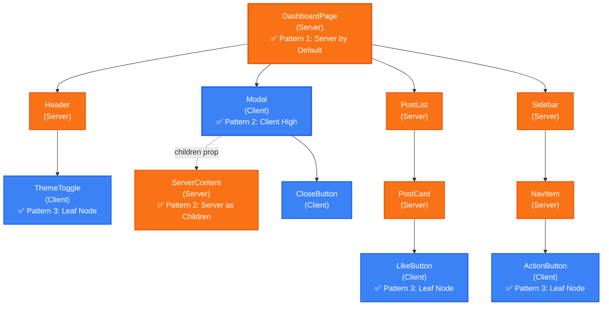

**Legend:** 🟠 Orange = Server Component | 🔵 Blue = Client Component

**Three Patterns in One Tree:**

- ✅ **Pattern 1: Server by Default** - Root is always a Server Component
- ✅ **Pattern 2: Client High, Server as Children** - Modal (Client) receives ServerContent via `children` prop
- ✅ **Pattern 3: Clients at Leaf Nodes** - ThemeToggle, LikeButton, ActionButton are interactive leaves

---

### Rendering & Hydration Flow

**How Server Components become interactive in the browser:**

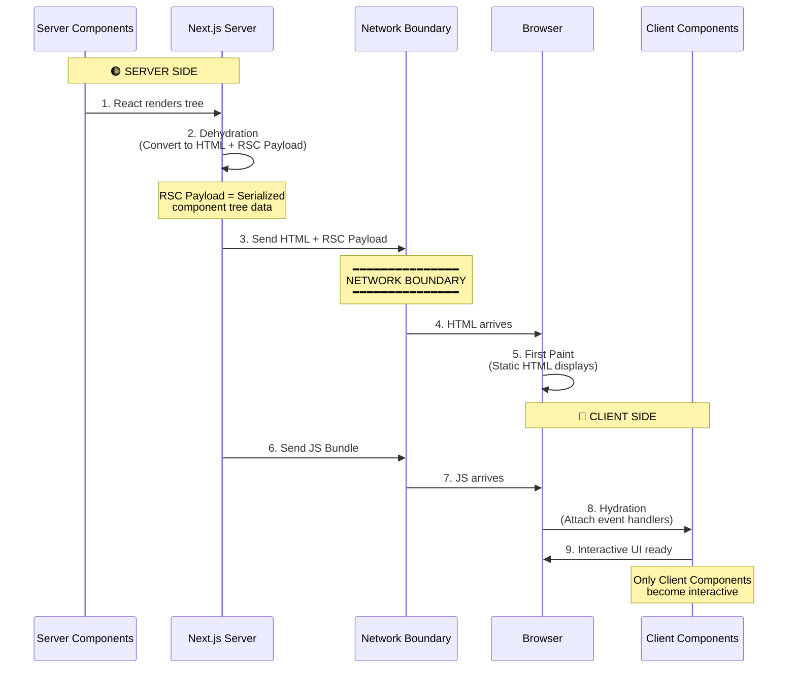

### Key Concepts

**RSC (React Server Components):** Components that render only on the server. They can be `async`, query databases directly, and never re-render on the client.

**Dehydration:** Converting Server Components into static HTML and an RSC Payload (serialized component data) on the server. This enables instant First Paint in the browser.

**Hydration:** React's process for attaching event handlers to the DOM to make static HTML interactive. **Only happens for Client Components** after the JS bundle crosses the network boundary.

---

### How It Works: Client-Side Rendering & Navigation

**Initial Page Load:**

When your application loads in the browser, three key assets work together:

1. **HTML** → Immediately shows a fast non-interactive preview (First Paint)
2. **RSC Payload** → Reconciles the Client and Server Component trees
3. **JavaScript** → Hydrates Client Components to make them interactive

**Subsequent Navigations:**

After initial load, navigation is optimized:

- RSC Payload is prefetched and cached for instant route changes
- Client Components render entirely on the client without server-rendered HTML
- Creates smooth, app-like experience without full page reloads

**Component Composition Rules:**

- ✅ Server Component can import and render Client Components
- ✅ Client Component can receive Server Components as `children` prop
- ❌ Client Component cannot import Server Components directly

**References:**

- [Next.js Server & Client Components](https://nextjs.org/docs/app/getting-started/server-and-client-components)
- [React Foundations: Server and Client Components](https://nextjs.org/learn/react-foundations/server-and-client-components)

---

## 2. TanStack Query: Client-Side Cache & Server Hydration

**Goal:** Manage asynchronous state in Client Components with automatic caching, synchronization, and seamless server-to-client data flow. TanStack Query eliminates manual loading states, provides optimistic updates, and enables instant UX through server prefetching.

### Server vs Client Rendering

**TanStack Query is a client-side library**, but Next.js enables server prefetching to hydrate the cache before the page loads.

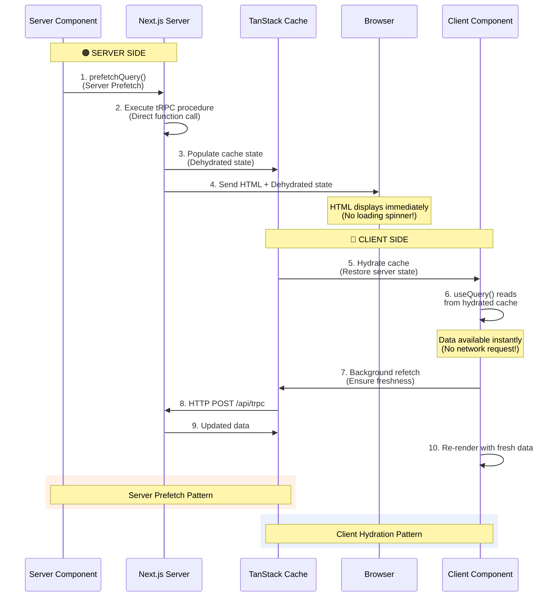

**Why Server Prefetch?**

- Eliminates loading spinners on initial page load
- Data is embedded in HTML (available immediately)
- Client Components receive pre-populated cache
- Background refetch ensures data freshness

**useQuery vs useSuspenseQuery:**

- **useQuery**: Returns `{data, isLoading, error}` → Manual loading states
- **useSuspenseQuery**: Suspends component until data loads → Integrates with React Suspense boundaries

**Decision Rule:**

- Use `useSuspenseQuery` when you have a Suspense boundary and want automatic loading UI
- Use `useQuery` when you need fine-grained control over loading states or show partial UI

---

### Mutations Strategy

**Where should mutations live?** Always on the client using `useMutation()` hooks in Client Components.

**Why Client-Side?**

- Mutations need user interaction (buttons, forms)
- Require optimistic updates for instant feedback
- Need access to TanStack Query's invalidation system
- Can't be triggered from Server Components

**Mutation Lifecycle:**

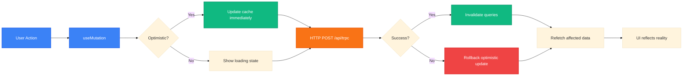

---

### Cache Update Patterns

**Three ways to update the cache after mutations:**

**1. Query Invalidation (Recommended Default)**

- Marks queries as stale and triggers automatic refetch
- Guarantees data consistency with server
- Use for most mutations

**2. Direct Cache Updates**

- Manually update cache using `setQueryData()`
- Avoids network request for predictable changes
- Use when mutation response contains all updated data

**3. Optimistic Updates**

- Update cache before mutation completes
- Rollback if mutation fails
- Use for instant user feedback (like buttons, toggles)

**Decision Tree:**

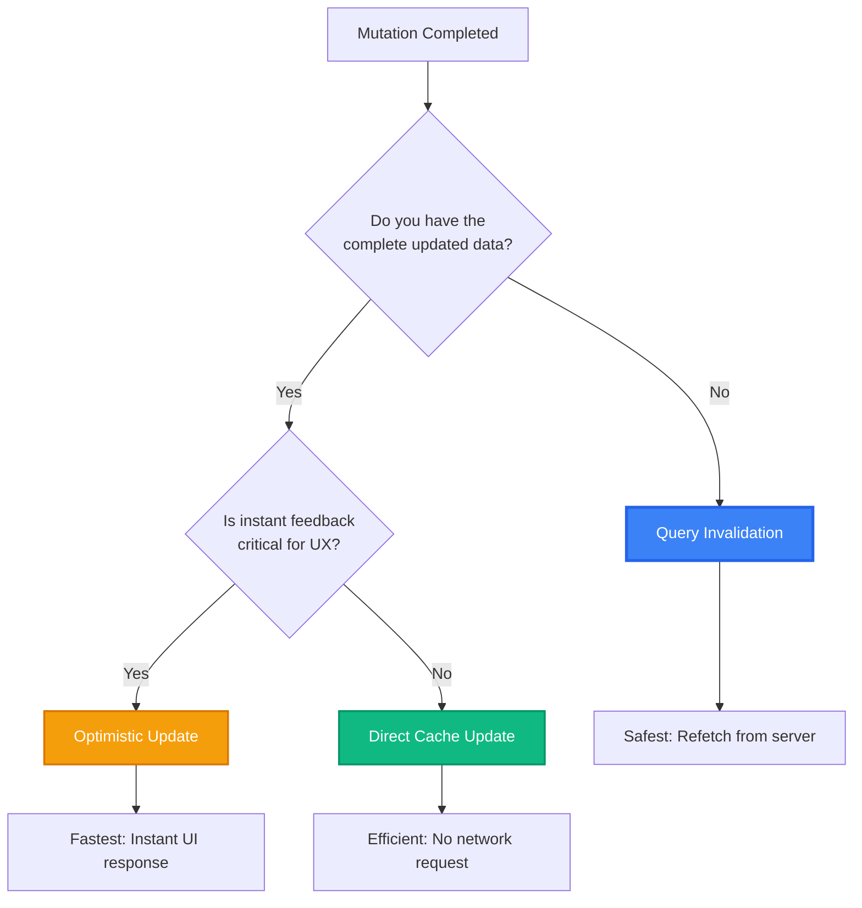

**How They Work:**

**Query Invalidation:**

- Marks cache entry as stale
- If component is mounted, triggers immediate refetch
- If component is unmounted, refetches on next mount

**Direct Cache Updates:**

- Use mutation response to update cache directly
- Skips network request entirely
- Must ensure updated data is complete and accurate

**Optimistic Updates:**

- Update cache immediately (before server responds)
- Store previous state for rollback
- On error, restore previous state and show error
- On success, optionally invalidate to ensure accuracy

---

### Render & Update Strategy

**Our Complete Data Flow Pattern:**

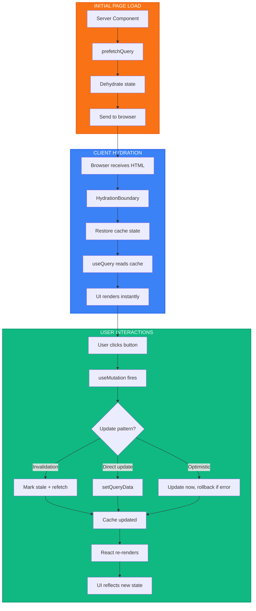

**The Strategy:**

1. **Server Prefetch**: Load critical data on server → zero loading spinners
2. **Client Hydration**: Restore cache in browser → instant UI
3. **Background Refetch**: Ensure data freshness → silent updates
4. **Mutations**: Use appropriate cache update pattern → consistent state
5. **Automatic Sync**: TanStack Query refetches on focus/reconnect → always fresh

**Key Principles:**

- Server Components fetch initial data (fast, no client JS)
- Client Components use `useQuery` to read hydrated cache (instant)
- Mutations always happen client-side (user interactions)
- Cache invalidation keeps everything synchronized
- Optimistic updates provide instant feedback when needed

---

### TanStack Query in Next.js Best Practices

**Server-Side Pattern (HydrationBoundary):**

- Wrap prefetched data with `HydrationBoundary` component
- Pass dehydrated state to client via `dehydrate(queryClient)`
- Client automatically hydrates cache from this state

**When to Prefetch:**

- Critical data visible above the fold
- Data needed for initial render
- Data with slow network requests

**When NOT to Prefetch:**

- Data below the fold or in tabs
- Data that changes frequently
- User-specific data that varies per request

**Cache Configuration:**

- Set appropriate `staleTime` (how long data stays fresh)
- Set appropriate `cacheTime` (how long unused data stays in memory)
- Enable automatic refetching on window focus for real-time updates
- Use query keys consistently for proper invalidation

**References:**

- [TanStack Query: Server Rendering & Hydration](https://tanstack.com/query/latest/docs/framework/react/guides/ssr)
- [TanStack Query: Prefetching in Next.js](https://tanstack.com/query/latest/docs/framework/react/guides/prefetching)
- [TanStack Query: useQuery vs useSuspenseQuery](https://tanstack.com/query/latest/docs/framework/react/guides/suspense)
- [TanStack Query: Mutations](https://tanstack.com/query/latest/docs/framework/react/guides/mutations)
- [TanStack Query: Optimistic Updates](https://tanstack.com/query/latest/docs/framework/react/guides/optimistic-updates)
- [TanStack Query: Invalidation](https://tanstack.com/query/latest/docs/framework/react/guides/query-invalidation)
- [TanStack Query: Important Defaults](https://tanstack.com/query/latest/docs/framework/react/guides/important-defaults)

---

## 3. tRPC: Type-Safe API Layer

**Goal:** Build end-to-end type-safe APIs without code generation, schemas, or REST conventions. tRPC creates a seamless bridge between your frontend and backend, with TypeScript inference providing compile-time guarantees about API contracts.

### Core Terminology

**Router:** A collection of procedures and/or other routers organized under a shared namespace that defines your API structure.

**Procedure:** An API endpoint that can be a query, mutation, or subscription, representing a single callable function exposed to the client.

**Context:** Shared state and dependencies (like database connections, session data, or authentication info) that every procedure can access during execution.

**How they work together:** Routers organize procedures into logical namespaces. Each procedure receives context on every request, enabling access to shared dependencies without prop drilling.

---

### API Route Organization Patterns

**Two primary approaches for structuring tRPC routers:**

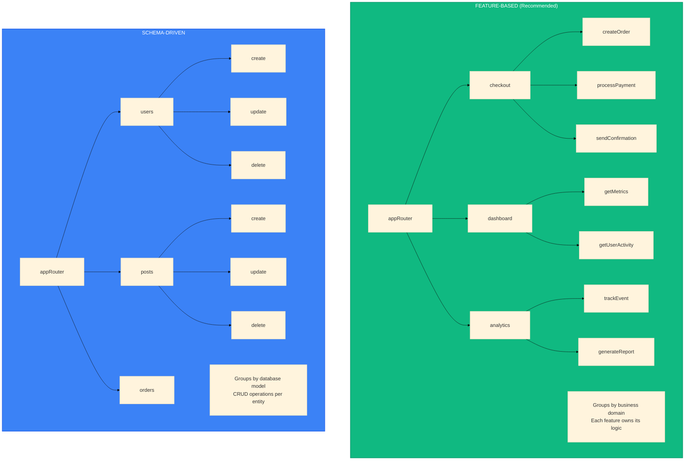

**Feature-Based Organization (Recommended):**

- Group procedures by business domain or user-facing features
- Each router encapsulates complete business workflows
- Benefits: Clear ownership, easier to navigate, scales with team growth
- Best for: Applications with distinct feature domains

**Schema-Driven Organization:**

- Group procedures by data model or database table
- Each router exposes CRUD operations for that entity
- Benefits: Direct mapping to database schema, predictable structure
- Best for: Admin panels, CMS systems, or API-first applications

**When to use each:**

- Choose feature-based when business logic spans multiple models (e.g., "checkout" involves users, orders, payments)
- Choose schema-driven when operations are primarily CRUD and map 1:1 to database tables
- Consider hybrid approach: Feature-based at top level with schema-driven within complex features

**Key principle:** Group by what changes together - procedures that are modified for the same reasons should live in the same router.

---

### Writing Queries in tRPC

**Conceptual flow for creating a query procedure:**

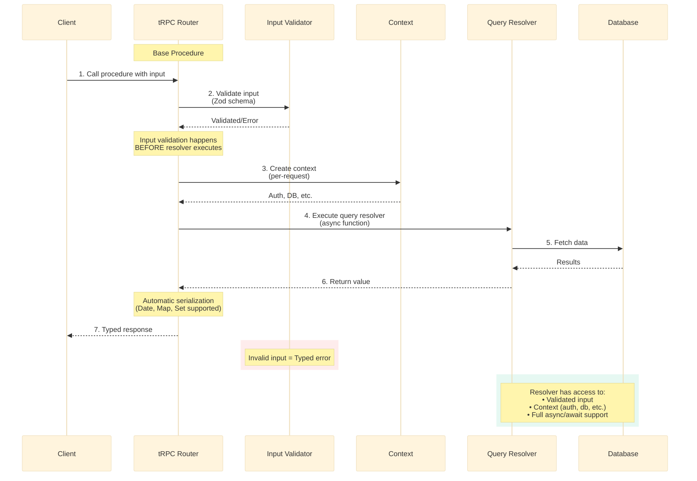

**Key Patterns:**

- **Input Validation:** Optional Zod schema validates input before resolver runs
- **Type Inference:** Input and output types are automatically inferred from schemas
- **Context Access:** Every resolver receives context with shared dependencies
- **Serialization:** Return values automatically serialized with SuperJSON
- **Error Handling:** Invalid input throws typed errors automatically

**Query Characteristics:**

- Read-only operations that don't modify server state
- Can be cached and prefetched by TanStack Query
- Support automatic retries on failure
- Can run in parallel for performance

---

### tRPC Ecosystem Architecture

**Complete view of how Context, Middleware, Router, and Procedures work together:**

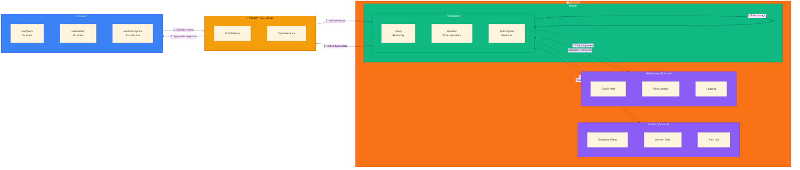

**Key Components:**

- **Context:** Shared dependencies available to all procedures (database, session, auth)
- **Middleware:** Optional request interceptors for cross-cutting concerns (auth checks, logging)
- **Router:** Organizes procedures into namespaces (e.g., `post.list`, `user.update`)
- **Procedures:** Individual API endpoints (queries for reads, mutations for writes)
- **Validation:** Zod schemas ensure type-safe inputs/outputs with runtime validation
- **Client Hooks:** React hooks that call procedures with full type inference

**Data Flow:**

1. Client calls procedure with inputs → Validation layer
2. Zod schema validates input types → Rejects invalid data early
3. Middleware checks (if present) → Auth, rate limits, etc.
4. Procedure executes → Accesses context for dependencies
5. Returns typed data → Automatic serialization
6. Client receives response → Type-safe, no manual typing needed

---

### Dual API Pattern (Server vs Client)

**tRPC provides two distinct APIs optimized for their execution environment:**

```mermaid
%%{init: {'theme':'base', 'themeVariables': {'fontSize':'18px'}, 'flowchart':{'padding':35, 'nodeSpacing':100, 'rankSpacing':90}}}%%
graph TB
    subgraph ServerSide["🟠 SERVER COMPONENT API"]
        SC1[Server Component] --> SC2["import api from '@/trpc/server'"]
        SC2 --> SC3["await api.post.list()"]
        SC3 --> SC4[Direct Function Call<br/>~5ms]
        SC4 --> SC5[No serialization overhead]
        SC5 --> SC6[(Database)]

        Note1[✅ Direct function invocation<br/>✅ No HTTP overhead<br/>✅ Full type safety<br/>✅ Access to server context]
    end

    subgraph ClientSide["🔵 CLIENT COMPONENT API"]
        CC1[Client Component] --> CC2["import api from '@/trpc/react'"]
        CC2 --> CC3["api.post.list.useQuery()"]
        CC3 --> CC4[TanStack Query Hook]
        CC4 --> CC5[HTTP POST /api/trpc<br/>~50ms]
        CC5 --> CC6[tRPC HTTP Handler]
        CC6 --> CC7[Deserialize → Execute → Serialize]
        CC7 --> CC8[(Database)]
        CC8 --> CC9[TanStack Query Cache]

        Note2[✅ React hooks integration<br/>✅ Automatic caching<br/>✅ Background refetching<br/>✅ Optimistic updates]
    end

    style ServerSide fill:#f97316,stroke:#ea580c,stroke-width:3px,color:#fff
    style ClientSide fill:#3b82f6,stroke:#2563eb,stroke-width:3px,color:#fff
    style SC6 fill:#8b5cf6,stroke:#7c3aed,stroke-width:2px,color:#fff
    style CC8 fill:#8b5cf6,stroke:#7c3aed,stroke-width:2px,color:#fff
```

**Performance Characteristics:**

- **Server API:** ~10x faster (5ms vs 50ms) due to no network roundtrip
- **Client API:** Provides caching, real-time updates, and optimistic UI

**When to use Server API:**

- Initial page loads (fastest time to first byte)
- Static or rarely-changing data
- SEO-critical content
- Data that must be available before hydration

**When to use Client API:**

- User interactions (forms, buttons, toggles)
- Real-time or frequently updating data
- Data that depends on client state
- Features requiring optimistic updates

---

### Integration Strategy with TanStack Query

**Complete server-to-client data flow with tRPC and TanStack Query:**

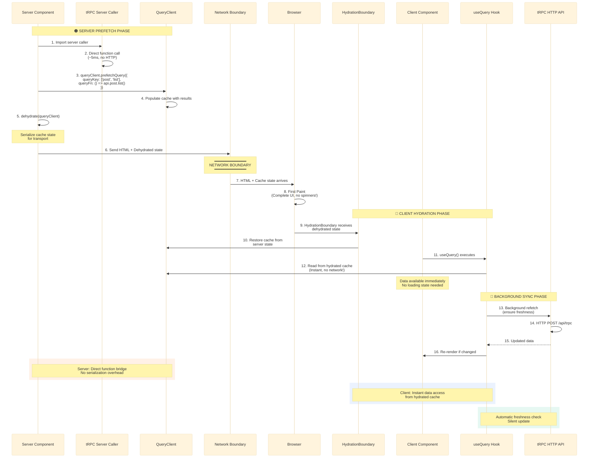

**How tRPC Server Caller enables this:**

- Creates direct function bridge bypassing HTTP layer
- No serialization/deserialization overhead on server
- Direct database access from Server Components
- Results feed directly into TanStack Query's dehydrated state
- Type safety maintained throughout entire flow

**Data Ownership Model:**

- **Server owns initial data:** Prefetch critical data for instant display
- **Client owns updates:** Mutations and refetches happen client-side
- **Cache is source of truth:** Both server and client update same cache
- **Background sync maintains freshness:** Automatic revalidation

---

### Cache Invalidation Anti-patterns

**Common mistakes that lead to stale data or poor performance:**

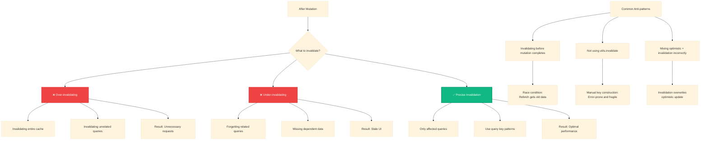

**Seven Critical Anti-patterns:**

1. **Over-invalidating:** Invalidating too many queries after mutation → unnecessary network requests, slower UX
2. **Under-invalidating:** Forgetting to invalidate related queries → UI shows stale data despite successful mutation
3. **Premature invalidation:** Invalidating before mutation completes → race condition where refetch retrieves old data
4. **Inconsistent query keys:** Different key structures for same data → cache fragmentation and missed updates
5. **Conflicting optimistic updates:** Invalidation refetch overwrites optimistic update → UI flickers between states
6. **Ignoring mount status:** Not understanding that only mounted queries refetch immediately → confusion about cache behavior
7. **Manual key construction:** Not using tRPC's `api.useUtils()` for invalidation → brittle code that breaks on refactoring

**Decision Tree for Invalidation:**

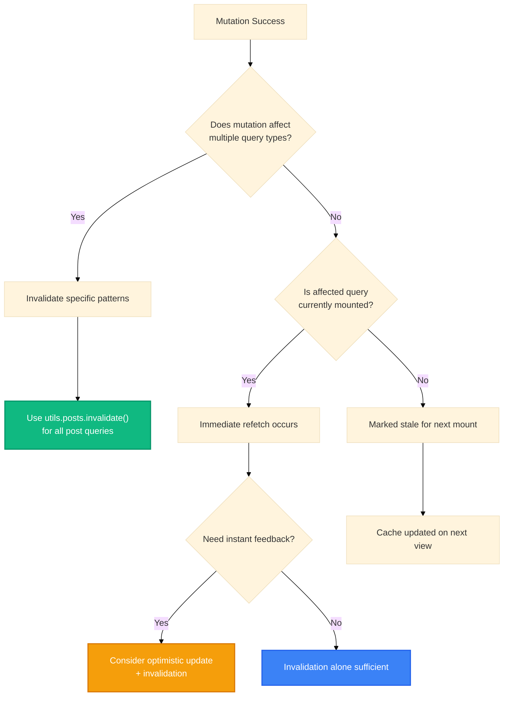

**Best Practices to Avoid Anti-patterns:**

- Always use `api.useUtils()` for type-safe invalidation
- Invalidate at the right granularity (specific queries, not entire cache)
- Wait for mutation success before invalidating
- Understand TanStack Query's mount-based refetch behavior
- Use optimistic updates for immediate feedback, then invalidate for accuracy
- Maintain consistent query key patterns across your application
- Test cache behavior in development with React Query Devtools

---

### Best Practices Summary

**Do:**

- ✅ Use feature-based router organization for complex applications
- ✅ Leverage server caller for initial data loads (10x performance boost)
- ✅ Prefetch critical data in Server Components
- ✅ Use `api.useUtils()` for type-safe cache invalidation
- ✅ Apply input validation with Zod schemas
- ✅ Share context across procedures for common dependencies

**Don't:**

- ❌ Make HTTP calls from Server Components (use server caller instead)
- ❌ Over-invalidate cache after mutations
- ❌ Mix different query key patterns for same data
- ❌ Forget to handle loading/error states in Client Components
- ❌ Manually construct query keys for invalidation
- ❌ Invalidate before mutation completes

**References:**

- [tRPC Concepts](https://trpc.io/docs/concepts)
- [tRPC Procedures](https://trpc.io/docs/server/procedures)
- [tRPC with Server Components](https://trpc.io/docs/client/tanstack-react-query/server-components)
- [TanStack Query SSR Guide](https://tanstack.com/query/latest/docs/framework/react/guides/advanced-ssr)

---

## Best Practices

1. **Default to Server Components** → Only use `'use client'` when needed
2. **Server for data fetching** → Use tRPC server caller
3. **Client for interactivity** → Use tRPC React hooks + TanStack Query
4. **Prefetch on server** → Eliminate loading states
5. **Invalidate after mutations** → Keep cache synchronized

---

## Additional Resources

- [Next.js App Router](https://nextjs.org/docs/app)
- [React Server Components RFC](https://github.com/reactjs/rfcs/blob/main/text/0188-server-components.md)
- [tRPC Documentation](https://trpc.io/docs)
- [TanStack Query Guides](https://tanstack.com/query/latest/docs/framework/react/guides)
- [Prisma Documentation](https://www.prisma.io/docs)
