# Fundamental Concepts

Core mental models for building hybrid server/client applications with Next.js, tRPC, and TanStack Query.

---

## 1. React & Next.js: Server vs Client Components

**Goal:** Ship less JavaScript to the browser while maintaining rich interactivity. Server Components render on the server with zero client-side JavaScript, while Client Components provide interactivity where needed.

### Component Tree Patterns

**Unified Component Tree showing all three composition patterns:**

**Legend:** 🟠 Orange = Server Component | 🔵 Blue = Client Component

**Three Patterns in One Tree:**
- ✅ **Pattern 1: Server by Default** - Root is always a Server Component
- ✅ **Pattern 2: Client High, Server as Children** - Modal (Client) receives ServerContent via `children` prop
- ✅ **Pattern 3: Clients at Leaf Nodes** - ThemeToggle, LikeButton, ActionButton are interactive leaves

---

### Rendering & Hydration Flow

**How Server Components become interactive in the browser:**

```mermaid
sequenceDiagram
    participant SC as Server Components
    participant Server as Next.js Server
    participant Net as Network Boundary
    participant Browser as Browser
    participant CC as Client Components

    Note over SC,Server: 🟠 SERVER SIDE
    SC->>Server: 1. React renders tree
    Server->>Server: 2. Dehydration<br/>(Convert to HTML + RSC Payload)
    Note over Server: RSC Payload = Serialized<br/>component tree data

    Server->>Net: 3. Send HTML + RSC Payload
    Note over Net: ━━━━━━━━━━━━━━━<br/>NETWORK BOUNDARY<br/>━━━━━━━━━━━━━━━
    Net->>Browser: 4. HTML arrives
    Browser->>Browser: 5. First Paint<br/>(Static HTML displays)

    Note over Browser,CC: 🔵 CLIENT SIDE
    Server->>Net: 6. Send JS Bundle
    Net->>Browser: 7. JS arrives
    Browser->>CC: 8. Hydration<br/>(Attach event handlers)
    CC->>Browser: 9. Interactive UI ready

    Note over CC: Only Client Components<br/>become interactive
```

### Key Concepts

**RSC (React Server Components):** Components that render only on the server. They can be `async`, query databases directly, and never re-render on the client.

**Dehydration:** Converting Server Components into static HTML and an RSC Payload (serialized component data) on the server. This enables instant First Paint in the browser.

**Hydration:** React's process for attaching event handlers to the DOM to make static HTML interactive. **Only happens for Client Components** after the JS bundle crosses the network boundary.

---

### How It Works: Client-Side Rendering & Navigation

**Initial Page Load:**

When your application loads in the browser, three key assets work together:

1. **HTML** → Immediately shows a fast non-interactive preview (First Paint)
2. **RSC Payload** → Reconciles the Client and Server Component trees
3. **JavaScript** → Hydrates Client Components to make them interactive

**Subsequent Navigations:**

After initial load, navigation is optimized:
- RSC Payload is prefetched and cached for instant route changes
- Client Components render entirely on the client without server-rendered HTML
- Creates smooth, app-like experience without full page reloads

**Component Composition Rules:**

- ✅ Server Component can import and render Client Components
- ✅ Client Component can receive Server Components as `children` prop
- ❌ Client Component cannot import Server Components directly

**References:**
- [Next.js Server & Client Components](https://nextjs.org/docs/app/getting-started/server-and-client-components)
- [React Foundations: Server and Client Components](https://nextjs.org/learn/react-foundations/server-and-client-components)

---

## 2. TanStack Query: Client-Side Cache

TanStack Query is a **client-side cache** that lives in browser memory.

**Key Operations:**

1. **Query:** `api.post.list.useQuery()` → Fetch & cache
2. **Mutation:** `api.post.create.useMutation()` → Modify & invalidate
3. **Prefetch:** `api.post.list.prefetch()` → Pre-load cache (no spinner!)

**Key Points:**

- Cache lives in browser memory (cleared on refresh)
- Automatically manages loading/error/success states
- Invalidate after mutations to stay fresh
- Prefetch on server for instant UX

**Reference:** [TanStack Query Docs](https://tanstack.com/query/latest)

---

## 3. tRPC: Dual API Pattern

tRPC provides **two different APIs** for Server vs Client Components.

**Performance:** Server Components are ~10x faster (no network roundtrip).

**When to use:**

- **Server Components:** Initial loads, static data, maximum performance
- **Client Components:** User interactions, real-time updates, dynamic features

**Reference:** [tRPC with Next.js](https://trpc.io/docs/client/nextjs/setup)

---

## Best Practices

1. **Default to Server Components** → Only use `'use client'` when needed
2. **Server for data fetching** → Use tRPC server caller
3. **Client for interactivity** → Use tRPC React hooks + TanStack Query
4. **Prefetch on server** → Eliminate loading states
5. **Invalidate after mutations** → Keep cache synchronized

---

## Additional Resources

- [Next.js App Router](https://nextjs.org/docs/app)
- [React Server Components RFC](https://github.com/reactjs/rfcs/blob/main/text/0188-server-components.md)
- [tRPC Documentation](https://trpc.io/docs)
- [TanStack Query Guides](https://tanstack.com/query/latest/docs/framework/react/guides)
- [Prisma Documentation](https://www.prisma.io/docs)
