# React & Next.js: Server vs Client Components

**Goal:** Ship less JavaScript to the browser while maintaining rich interactivity. Server Components render on the server with zero client-side JavaScript, while Client Components provide interactivity where needed.

## Component Tree Patterns

**Unified Component Tree showing all three composition patterns:**

```mermaid
graph TB
    A["DashboardPage<br/>(Server)<br/>✅ Pattern 1: Server by Default"]

    A --> B["Header<br/>(Server)"]
    A --> C["Modal<br/>(Client)<br/>✅ Pattern 2: Client High"]
    A --> D["PostList<br/>(Server)"]
    A --> E["Sidebar<br/>(Server)"]

    B --> F["ThemeToggle<br/>(Client)<br/>✅ Pattern 3: Leaf Node"]

    C -.->|"children prop"| G["ServerContent<br/>(Server)<br/>✅ Pattern 2: Server as Children"]
    C --> H["CloseButton<br/>(Client)"]

    D --> I["PostCard<br/>(Server)"]
    I --> J["LikeButton<br/>(Client)<br/>✅ Pattern 3: Leaf Node"]

    E --> K["NavItem<br/>(Server)"]
    K --> L["ActionButton<br/>(Client)<br/>✅ Pattern 3: Leaf Node"]

    style A fill:#f97316,stroke:#ea580c,stroke-width:3px,color:#fff
    style B fill:#f97316,stroke:#ea580c,stroke-width:2px,color:#fff
    style C fill:#3b82f6,stroke:#2563eb,stroke-width:3px,color:#fff
    style D fill:#f97316,stroke:#ea580c,stroke-width:2px,color:#fff
    style E fill:#f97316,stroke:#ea580c,stroke-width:2px,color:#fff
    style F fill:#3b82f6,stroke:#2563eb,stroke-width:2px,color:#fff
    style G fill:#f97316,stroke:#ea580c,stroke-width:2px,color:#fff
    style H fill:#3b82f6,stroke:#2563eb,stroke-width:2px,color:#fff
    style I fill:#f97316,stroke:#ea580c,stroke-width:2px,color:#fff
    style J fill:#3b82f6,stroke:#2563eb,stroke-width:2px,color:#fff
    style K fill:#f97316,stroke:#ea580c,stroke-width:2px,color:#fff
    style L fill:#3b82f6,stroke:#2563eb,stroke-width:2px,color:#fff
```

**Legend:** 🟠 Orange = Server Component | 🔵 Blue = Client Component

**Three Patterns in One Tree:**

- ✅ **Pattern 1: Server by Default** - Root is always a Server Component
- ✅ **Pattern 2: Client High, Server as Children** - Modal (Client) receives ServerContent via `children` prop
- ✅ **Pattern 3: Clients at Leaf Nodes** - ThemeToggle, LikeButton, ActionButton are interactive leaves

---

## Rendering & Hydration Flow

**How Server Components become interactive in the browser:**

```mermaid
sequenceDiagram
    participant SC as Server Components
    participant Server as Next.js Server
    participant Net as Network Boundary
    participant Browser as Browser
    participant CC as Client Components

    Note over SC,Server: 🟠 SERVER SIDE
    SC->>Server: 1. React renders tree
    Server->>Server: 2. Dehydration<br/>(Convert to HTML + RSC Payload)
    Note over Server: RSC Payload = Serialized<br/>component tree data

    Server->>Net: 3. Send HTML + RSC Payload
    Note over Net: ━━━━━━━━━━━━━━━<br/>NETWORK BOUNDARY<br/>━━━━━━━━━━━━━━━
    Net->>Browser: 4. HTML arrives
    Browser->>Browser: 5. First Paint<br/>(Static HTML displays)

    Note over Browser,CC: 🔵 CLIENT SIDE
    Server->>Net: 6. Send JS Bundle
    Net->>Browser: 7. JS arrives
    Browser->>CC: 8. Hydration<br/>(Attach event handlers)
    CC->>Browser: 9. Interactive UI ready

    Note over CC: Only Client Components<br/>become interactive
```

## Key Concepts

**RSC (React Server Components):** Components that render only on the server. They can be `async`, query databases directly, and never re-render on the client.

**Dehydration:** Converting Server Components into static HTML and an RSC Payload (serialized component data) on the server. This enables instant First Paint in the browser.

**Hydration:** React's process for attaching event handlers to the DOM to make static HTML interactive. **Only happens for Client Components** after the JS bundle crosses the network boundary.

---

## How It Works: Client-Side Rendering & Navigation

**Initial Page Load:**

When your application loads in the browser, three key assets work together:

1. **HTML** → Immediately shows a fast non-interactive preview (First Paint)
2. **RSC Payload** → Reconciles the Client and Server Component trees
3. **JavaScript** → Hydrates Client Components to make them interactive

**Subsequent Navigations:**

After initial load, navigation is optimized:

- RSC Payload is prefetched and cached for instant route changes
- Client Components render entirely on the client without server-rendered HTML
- Creates smooth, app-like experience without full page reloads

**Component Composition Rules:**

- ✅ Server Component can import and render Client Components
- ✅ Client Component can receive Server Components as `children` prop
- ❌ Client Component cannot import Server Components directly

**References:**

- [Next.js Server & Client Components](https://nextjs.org/docs/app/getting-started/server-and-client-components)
- [React Foundations: Server and Client Components](https://nextjs.org/learn/react-foundations/server-and-client-components)
