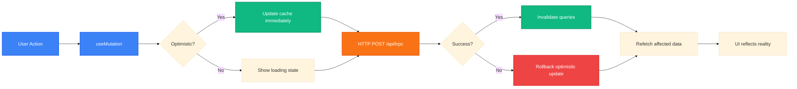
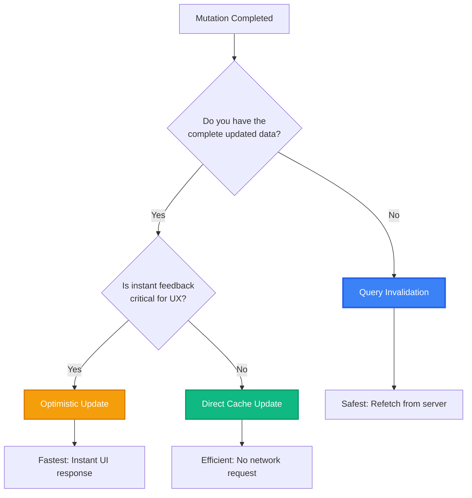
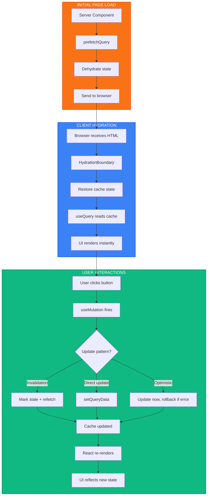

# TanStack Query: Client-Side Cache & Server Hydration

**Goal:** Manage asynchronous state in Client Components with automatic caching, synchronization, and seamless server-to-client data flow. TanStack Query eliminates manual loading states, provides optimistic updates, and enables instant UX through server prefetching.

## Server vs Client Rendering

**TanStack Query is a client-side library**, but Next.js enables server prefetching to hydrate the cache before the page loads.

```mermaid
sequenceDiagram
    participant RSC as Server Component
    participant Server as Next.js Server
    participant Cache as TanStack Cache
    participant Browser as Browser
    participant Client as Client Component

    Note over RSC,Server: 🟠 SERVER SIDE
    RSC->>Server: 1. prefetchQuery()<br/>(Server Prefetch)
    Server->>Server: 2. Execute tRPC procedure<br/>(Direct function call)
    Server->>Cache: 3. Populate cache state<br/>(Dehydrated state)

    Server->>Browser: 4. Send HTML + Dehydrated state
    Note over Browser: HTML displays immediately<br/>(No loading spinner!)

    Note over Cache,Client: 🔵 CLIENT SIDE
    Cache->>Client: 5. Hydrate cache<br/>(Restore server state)
    Client->>Client: 6. useQuery() reads<br/>from hydrated cache
    Note over Client: Data available instantly<br/>(No network request!)

    Client->>Cache: 7. Background refetch<br/>(Ensure freshness)
    Cache->>Server: 8. HTTP POST /api/trpc
    Server->>Cache: 9. Updated data
    Client->>Client: 10. Re-render with fresh data

    rect rgba(249, 115, 22, 0.1)
        Note over RSC,Cache: Server Prefetch Pattern
    end

    rect rgba(59, 130, 246, 0.1)
        Note over Cache,Client: Client Hydration Pattern
    end
```

**Why Server Prefetch?**

- Eliminates loading spinners on initial page load
- Data is embedded in HTML (available immediately)
- Client Components receive pre-populated cache
- Background refetch ensures data freshness

**useQuery vs useSuspenseQuery:**

- **useQuery**: Returns `{data, isLoading, error}` → Manual loading states
- **useSuspenseQuery**: Suspends component until data loads → Integrates with React Suspense boundaries

**Decision Rule:**

- Use `useSuspenseQuery` when you have a Suspense boundary and want automatic loading UI
- Use `useQuery` when you need fine-grained control over loading states or show partial UI

---

## Mutations Strategy

**Where should mutations live?** Always on the client using `useMutation()` hooks in Client Components.

**Why Client-Side?**

- Mutations need user interaction (buttons, forms)
- Require optimistic updates for instant feedback
- Need access to TanStack Query's invalidation system
- Can't be triggered from Server Components

**Mutation Lifecycle:**

---

## Cache Update Patterns

**Three ways to update the cache after mutations:**

**1. Query Invalidation (Recommended Default)**

- Marks queries as stale and triggers automatic refetch
- Guarantees data consistency with server
- Use for most mutations

**2. Direct Cache Updates**

- Manually update cache using `setQueryData()`
- Avoids network request for predictable changes
- Use when mutation response contains all updated data

**3. Optimistic Updates**

- Update cache before mutation completes
- Rollback if mutation fails
- Use for instant user feedback (like buttons, toggles)

**Decision Tree:**

**How They Work:**

**Query Invalidation:**

- Marks cache entry as stale
- If component is mounted, triggers immediate refetch
- If component is unmounted, refetches on next mount

**Direct Cache Updates:**

- Use mutation response to update cache directly
- Skips network request entirely
- Must ensure updated data is complete and accurate

**Optimistic Updates:**

- Update cache immediately (before server responds)
- Store previous state for rollback
- On error, restore previous state and show error
- On success, optionally invalidate to ensure accuracy

---

## Render & Update Strategy

**Our Complete Data Flow Pattern:**

**The Strategy:**

1. **Server Prefetch**: Load critical data on server → zero loading spinners
2. **Client Hydration**: Restore cache in browser → instant UI
3. **Background Refetch**: Ensure data freshness → silent updates
4. **Mutations**: Use appropriate cache update pattern → consistent state
5. **Automatic Sync**: TanStack Query refetches on focus/reconnect → always fresh

**Key Principles:**

- Server Components fetch initial data (fast, no client JS)
- Client Components use `useQuery` to read hydrated cache (instant)
- Mutations always happen client-side (user interactions)
- Cache invalidation keeps everything synchronized
- Optimistic updates provide instant feedback when needed

---

## TanStack Query in Next.js Best Practices

**Server-Side Pattern (HydrationBoundary):**

- Wrap prefetched data with `HydrationBoundary` component
- Pass dehydrated state to client via `dehydrate(queryClient)`
- Client automatically hydrates cache from this state

**When to Prefetch:**

- Critical data visible above the fold
- Data needed for initial render
- Data with slow network requests

**When NOT to Prefetch:**

- Data below the fold or in tabs
- Data that changes frequently
- User-specific data that varies per request

**Cache Configuration:**

- Set appropriate `staleTime` (how long data stays fresh)
- Set appropriate `cacheTime` (how long unused data stays in memory)
- Enable automatic refetching on window focus for real-time updates
- Use query keys consistently for proper invalidation

**References:**

- [TanStack Query: Server Rendering & Hydration](https://tanstack.com/query/latest/docs/framework/react/guides/ssr)
- [TanStack Query: Prefetching in Next.js](https://tanstack.com/query/latest/docs/framework/react/guides/prefetching)
- [TanStack Query: useQuery vs useSuspenseQuery](https://tanstack.com/query/latest/docs/framework/react/guides/suspense)
- [TanStack Query: Mutations](https://tanstack.com/query/latest/docs/framework/react/guides/mutations)
- [TanStack Query: Optimistic Updates](https://tanstack.com/query/latest/docs/framework/react/guides/optimistic-updates)
- [TanStack Query: Invalidation](https://tanstack.com/query/latest/docs/framework/react/guides/query-invalidation)
- [TanStack Query: Important Defaults](https://tanstack.com/query/latest/docs/framework/react/guides/important-defaults)
