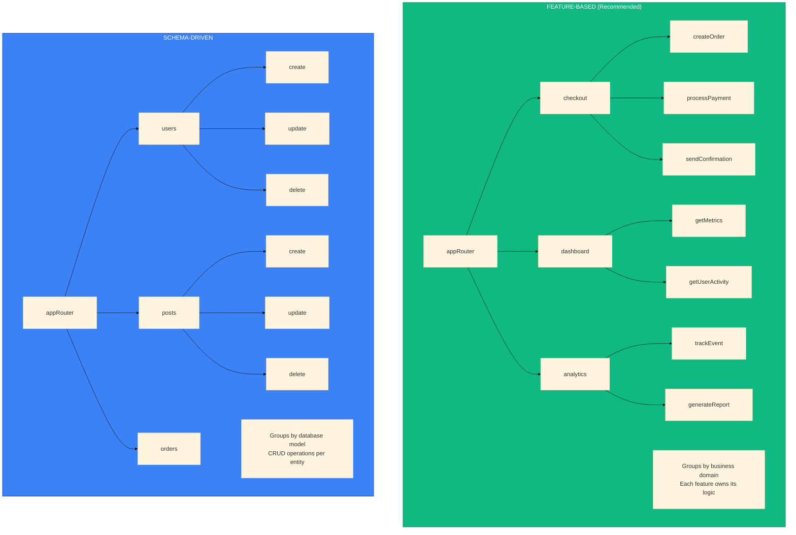
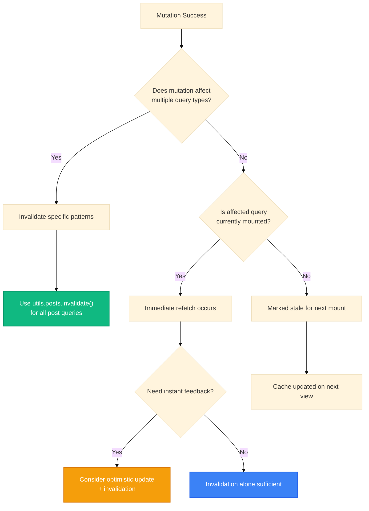

# tRPC: Type-Safe API Layer

**Goal:** Build end-to-end type-safe APIs without code generation, schemas, or REST conventions. tRPC creates a seamless bridge between your frontend and backend, with TypeScript inference providing compile-time guarantees about API contracts.

## Core Terminology

**Router:** A collection of procedures and/or other routers organized under a shared namespace that defines your API structure.

**Procedure:** An API endpoint that can be a query, mutation, or subscription, representing a single callable function exposed to the client.

**Context:** Shared state and dependencies (like database connections, session data, or authentication info) that every procedure can access during execution.

**How they work together:** Routers organize procedures into logical namespaces. Each procedure receives context on every request, enabling access to shared dependencies without prop drilling.

---

## API Route Organization Patterns

**Two primary approaches for structuring tRPC routers:**

**Feature-Based Organization (Recommended):**

- Group procedures by business domain or user-facing features
- Each router encapsulates complete business workflows
- Benefits: Clear ownership, easier to navigate, scales with team growth
- Best for: Applications with distinct feature domains

**Schema-Driven Organization:**

- Group procedures by data model or database table
- Each router exposes CRUD operations for that entity
- Benefits: Direct mapping to database schema, predictable structure
- Best for: Admin panels, CMS systems, or API-first applications

**When to use each:**

- Choose feature-based when business logic spans multiple models (e.g., "checkout" involves users, orders, payments)
- Choose schema-driven when operations are primarily CRUD and map 1:1 to database tables
- Consider hybrid approach: Feature-based at top level with schema-driven within complex features

**Key principle:** Group by what changes together - procedures that are modified for the same reasons should live in the same router.

---

## Writing Queries in tRPC

**Conceptual flow for creating a query procedure:**

```mermaid
%%{init: {'theme':'base', 'themeVariables': {'fontSize':'15px'}, 'sequence':{'width':200, 'height':80}}}%%
sequenceDiagram
    participant Client
    participant tRPC as tRPC Router
    participant Validator as Input Validator
    participant Context
    participant Resolver as Query Resolver
    participant DB as Database

    Note over tRPC: Base Procedure
    Client->>tRPC: 1. Call procedure with input

    tRPC->>Validator: 2. Validate input<br/>(Zod schema)
    Validator-->>tRPC: Validated/Error

    Note over tRPC: Input validation happens<br/>BEFORE resolver executes

    tRPC->>Context: 3. Create context<br/>(per-request)
    Context-->>tRPC: Auth, DB, etc.

    tRPC->>Resolver: 4. Execute query resolver<br/>(async function)
    Resolver->>DB: 5. Fetch data
    DB-->>Resolver: Results

    Resolver-->>tRPC: 6. Return value
    Note over tRPC: Automatic serialization<br/>(Date, Map, Set supported)

    tRPC-->>Client: 7. Typed response

    rect rgba(239, 68, 68, 0.1)
        Note over Validator: Invalid input = Typed error
    end

    rect rgba(16, 185, 129, 0.1)
        Note over Resolver,DB: Resolver has access to:<br/>• Validated input<br/>• Context (auth, db, etc.)<br/>• Full async/await support
    end
```

**Key Patterns:**

- **Input Validation:** Optional Zod schema validates input before resolver runs
- **Type Inference:** Input and output types are automatically inferred from schemas
- **Context Access:** Every resolver receives context with shared dependencies
- **Serialization:** Return values automatically serialized with SuperJSON
- **Error Handling:** Invalid input throws typed errors automatically

**Query Characteristics:**

- Read-only operations that don't modify server state
- Can be cached and prefetched by TanStack Query
- Support automatic retries on failure
- Can run in parallel for performance

---

## tRPC Ecosystem Architecture

**Complete view of how Context, Middleware, Router, and Procedures work together:**

```mermaid
%%{init: {'theme':'base', 'themeVariables': {'fontSize':'19px'}, 'flowchart':{'padding':40, 'nodeSpacing':120, 'rankSpacing':120}}}%%
graph LR
    subgraph Server["🟠 SERVER"]
        subgraph Context["Context (Optional)"]
            CTX1[Database Client]
            CTX2[Session Data]
            CTX3[Auth Info]
        end

        subgraph Middleware["Middleware (Optional)"]
            MW1[Check Auth]
            MW2[Rate Limiting]
            MW3[Logging]
        end

        subgraph Router["Router"]
            subgraph Procedures["Procedures"]
                P1[Query<br/>Read-only]
                P2[Mutation<br/>Write operations]
                P3[Subscription<br/>Real-time]
            end
        end

        Context -.->|Provides dependencies| Procedures
        Middleware -.->|Validates/Transforms| Procedures
    end

    subgraph Validation["⚡ VALIDATION LAYER"]
        V1[Zod Schema]
        V2[Type Inference]
    end

    subgraph Client["🔵 CLIENT"]
        C1[useQuery<br/>for reads]
        C2[useMutation<br/>for writes]
        C3[useSubscription<br/>for real-time]
    end

    Client -->|1. Call with inputs| Validation
    Validation -->|2. Validate inputs| Procedures
    Procedures -->|3. Execute logic| Procedures
    Procedures -.->|4. Access if needed| Context
    Procedures -.->|5. Check if present| Middleware
    Procedures -->|6. Return typed data| Validation
    Validation -->|7. Type-safe response| Client

    style Server fill:#f97316,stroke:#ea580c,stroke-width:3px,color:#fff
    style Context fill:#8b5cf6,stroke:#7c3aed,stroke-width:2px,color:#fff
    style Middleware fill:#8b5cf6,stroke:#7c3aed,stroke-width:2px,color:#fff
    style Router fill:#10b981,stroke:#059669,stroke-width:2px,color:#fff
    style Procedures fill:#10b981,stroke:#059669,stroke-width:2px,color:#fff
    style Validation fill:#f59e0b,stroke:#d97706,stroke-width:3px,color:#000
    style Client fill:#3b82f6,stroke:#2563eb,stroke-width:3px,color:#fff
```

**Key Components:**

- **Context:** Shared dependencies available to all procedures (database, session, auth)
- **Middleware:** Optional request interceptors for cross-cutting concerns (auth checks, logging)
- **Router:** Organizes procedures into namespaces (e.g., `post.list`, `user.update`)
- **Procedures:** Individual API endpoints (queries for reads, mutations for writes)
- **Validation:** Zod schemas ensure type-safe inputs/outputs with runtime validation
- **Client Hooks:** React hooks that call procedures with full type inference

**Data Flow:**

1. Client calls procedure with inputs → Validation layer
2. Zod schema validates input types → Rejects invalid data early
3. Middleware checks (if present) → Auth, rate limits, etc.
4. Procedure executes → Accesses context for dependencies
5. Returns typed data → Automatic serialization
6. Client receives response → Type-safe, no manual typing needed

---

## Dual API Pattern (Server vs Client)

**tRPC provides two distinct APIs optimized for their execution environment:**

```mermaid
%%{init: {'theme':'base', 'themeVariables': {'fontSize':'18px'}, 'flowchart':{'padding':35, 'nodeSpacing':100, 'rankSpacing':90}}}%%
graph TB
    subgraph ServerSide["🟠 SERVER COMPONENT API"]
        SC1[Server Component] --> SC2["import api from '@/trpc/server'"]
        SC2 --> SC3["await api.post.list()"]
        SC3 --> SC4[Direct Function Call<br/>~5ms]
        SC4 --> SC5[No serialization overhead]
        SC5 --> SC6[(Database)]

        Note1[✅ Direct function invocation<br/>✅ No HTTP overhead<br/>✅ Full type safety<br/>✅ Access to server context]
    end

    subgraph ClientSide["🔵 CLIENT COMPONENT API"]
        CC1[Client Component] --> CC2["import api from '@/trpc/react'"]
        CC2 --> CC3["api.post.list.useQuery()"]
        CC3 --> CC4[TanStack Query Hook]
        CC4 --> CC5[HTTP POST /api/trpc<br/>~50ms]
        CC5 --> CC6[tRPC HTTP Handler]
        CC6 --> CC7[Deserialize → Execute → Serialize]
        CC7 --> CC8[(Database)]
        CC8 --> CC9[TanStack Query Cache]

        Note2[✅ React hooks integration<br/>✅ Automatic caching<br/>✅ Background refetching<br/>✅ Optimistic updates]
    end

    style ServerSide fill:#f97316,stroke:#ea580c,stroke-width:3px,color:#fff
    style ClientSide fill:#3b82f6,stroke:#2563eb,stroke-width:3px,color:#fff
    style SC6 fill:#8b5cf6,stroke:#7c3aed,stroke-width:2px,color:#fff
    style CC8 fill:#8b5cf6,stroke:#7c3aed,stroke-width:2px,color:#fff
```

**Performance Characteristics:**

- **Server API:** ~10x faster (5ms vs 50ms) due to no network roundtrip
- **Client API:** Provides caching, real-time updates, and optimistic UI

**When to use Server API:**

- Initial page loads (fastest time to first byte)
- Static or rarely-changing data
- SEO-critical content
- Data that must be available before hydration

**When to use Client API:**

- User interactions (forms, buttons, toggles)
- Real-time or frequently updating data
- Data that depends on client state
- Features requiring optimistic updates

---

## Integration Strategy with TanStack Query

**Complete server-to-client data flow with tRPC and TanStack Query:**

```mermaid
%%{init: {'theme':'base', 'themeVariables': {'fontSize':'15px'}, 'sequence':{'width':220, 'height':90, 'boxMargin':12}}}%%
sequenceDiagram
    participant SC as Server Component
    participant tRPC as tRPC Server Caller
    participant QC as QueryClient
    participant Net as Network Boundary
    participant Browser
    participant HB as HydrationBoundary
    participant CC as Client Component
    participant Hook as useQuery Hook
    participant API as tRPC HTTP API

    Note over SC,QC: 🟠 SERVER PREFETCH PHASE
    SC->>tRPC: 1. Import server caller
    tRPC->>tRPC: 2. Direct function call<br/>(~5ms, no HTTP)

    SC->>QC: 3. queryClient.prefetchQuery({<br/>queryKey: ['post', 'list'],<br/>queryFn: () => api.post.list()<br/>})

    QC->>QC: 4. Populate cache with results

    SC->>SC: 5. dehydrate(queryClient)
    Note over SC: Serialize cache state<br/>for transport

    SC->>Net: 6. Send HTML + Dehydrated state

    Note over Net: ━━━━━━━━━━━━━━<br/>NETWORK BOUNDARY<br/>━━━━━━━━━━━━━━

    Net->>Browser: 7. HTML + Cache state arrives
    Browser->>Browser: 8. First Paint<br/>(Complete UI, no spinners!)

    Note over HB,Hook: 🔵 CLIENT HYDRATION PHASE
    Browser->>HB: 9. HydrationBoundary receives<br/>dehydrated state

    HB->>QC: 10. Restore cache from<br/>server state

    CC->>Hook: 11. useQuery() executes
    Hook->>QC: 12. Read from hydrated cache<br/>(Instant, no network!)

    Note over CC: Data available immediately<br/>No loading state needed

    Note over Hook,API: 🔄 BACKGROUND SYNC PHASE
    Hook->>API: 13. Background refetch<br/>(ensure freshness)
    API->>API: 14. HTTP POST /api/trpc
    API-->>Hook: 15. Updated data
    Hook->>CC: 16. Re-render if changed

    rect rgba(249, 115, 22, 0.1)
        Note over SC,QC: Server: Direct function bridge<br/>No serialization overhead
    end

    rect rgba(59, 130, 246, 0.1)
        Note over HB,Hook: Client: Instant data access<br/>from hydrated cache
    end

    rect rgba(16, 185, 129, 0.1)
        Note over Hook,API: Automatic freshness check<br/>Silent update
    end
```

**How tRPC Server Caller enables this:**

- Creates direct function bridge bypassing HTTP layer
- No serialization/deserialization overhead on server
- Direct database access from Server Components
- Results feed directly into TanStack Query's dehydrated state
- Type safety maintained throughout entire flow

**Data Ownership Model:**

- **Server owns initial data:** Prefetch critical data for instant display
- **Client owns updates:** Mutations and refetches happen client-side
- **Cache is source of truth:** Both server and client update same cache
- **Background sync maintains freshness:** Automatic revalidation

---

## Cache Invalidation Anti-patterns

**Common mistakes that lead to stale data or poor performance:**

```mermaid
%%{init: {'theme':'base', 'themeVariables': {'fontSize':'18px'}, 'flowchart':{'padding':35, 'nodeSpacing':100, 'rankSpacing':90}}}%%
graph TD
    A[After Mutation] --> B{What to invalidate?}

    B --> C[❌ Over-invalidating]
    C --> C1[Invalidating entire cache]
    C --> C2[Invalidating unrelated queries]
    C --> C3[Result: Unnecessary requests]

    B --> D[❌ Under-invalidating]
    D --> D1[Forgetting related queries]
    D --> D2[Missing dependent data]
    D --> D3[Result: Stale UI]

    B --> E[✅ Precise Invalidation]
    E --> E1[Only affected queries]
    E --> E2[Use query key patterns]
    E --> E3[Result: Optimal performance]

    F[Common Anti-patterns] --> G[Invalidating before mutation completes]
    F --> H[Not using utils.invalidate]
    F --> I[Mixing optimistic + invalidation incorrectly]

    G --> G1[Race condition:<br/>Refetch gets old data]
    H --> H1[Manual key construction:<br/>Error-prone and fragile]
    I --> I1[Invalidation overwrites<br/>optimistic update]

    style C fill:#ef4444,stroke:#dc2626,stroke-width:2px,color:#fff
    style D fill:#ef4444,stroke:#dc2626,stroke-width:2px,color:#fff
    style E fill:#10b981,stroke:#059669,stroke-width:3px,color:#fff
```

**Seven Critical Anti-patterns:**

1. **Over-invalidating:** Invalidating too many queries after mutation → unnecessary network requests, slower UX
2. **Under-invalidating:** Forgetting to invalidate related queries → UI shows stale data despite successful mutation
3. **Premature invalidation:** Invalidating before mutation completes → race condition where refetch retrieves old data
4. **Inconsistent query keys:** Different key structures for same data → cache fragmentation and missed updates
5. **Conflicting optimistic updates:** Invalidation refetch overwrites optimistic update → UI flickers between states
6. **Ignoring mount status:** Not understanding that only mounted queries refetch immediately → confusion about cache behavior
7. **Manual key construction:** Not using tRPC's `api.useUtils()` for invalidation → brittle code that breaks on refactoring

**Decision Tree for Invalidation:**

**Best Practices to Avoid Anti-patterns:**

- Always use `api.useUtils()` for type-safe invalidation
- Invalidate at the right granularity (specific queries, not entire cache)
- Wait for mutation success before invalidating
- Understand TanStack Query's mount-based refetch behavior
- Use optimistic updates for immediate feedback, then invalidate for accuracy
- Maintain consistent query key patterns across your application
- Test cache behavior in development with React Query Devtools

---

## Best Practices Summary

**Do:**

- ✅ Use feature-based router organization for complex applications
- ✅ Leverage server caller for initial data loads (10x performance boost)
- ✅ Prefetch critical data in Server Components
- ✅ Use `api.useUtils()` for type-safe cache invalidation
- ✅ Apply input validation with Zod schemas
- ✅ Share context across procedures for common dependencies

**Don't:**

- ❌ Make HTTP calls from Server Components (use server caller instead)
- ❌ Over-invalidate cache after mutations
- ❌ Mix different query key patterns for same data
- ❌ Forget to handle loading/error states in Client Components
- ❌ Manually construct query keys for invalidation
- ❌ Invalidate before mutation completes

**References:**

- [tRPC Concepts](https://trpc.io/docs/concepts)
- [tRPC Procedures](https://trpc.io/docs/server/procedures)
- [tRPC with Server Components](https://trpc.io/docs/client/tanstack-react-query/server-components)
- [TanStack Query SSR Guide](https://tanstack.com/query/latest/docs/framework/react/guides/advanced-ssr)
