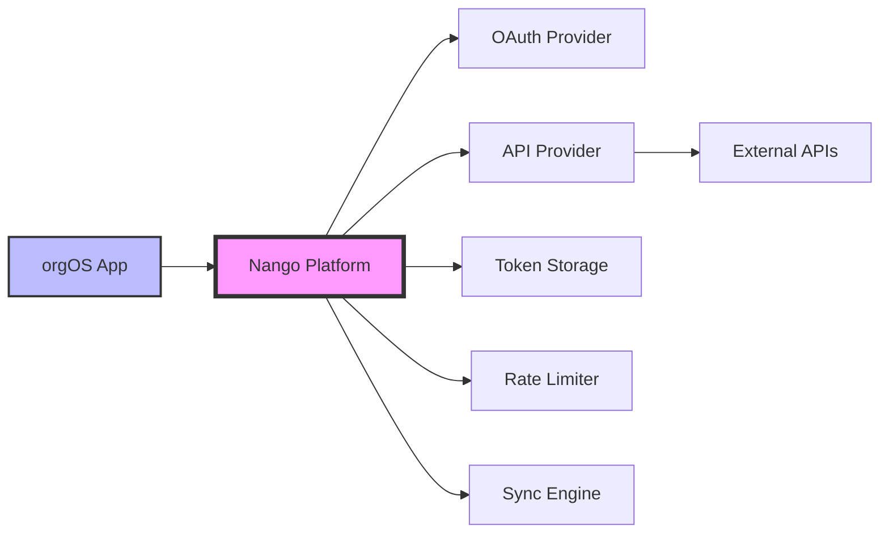
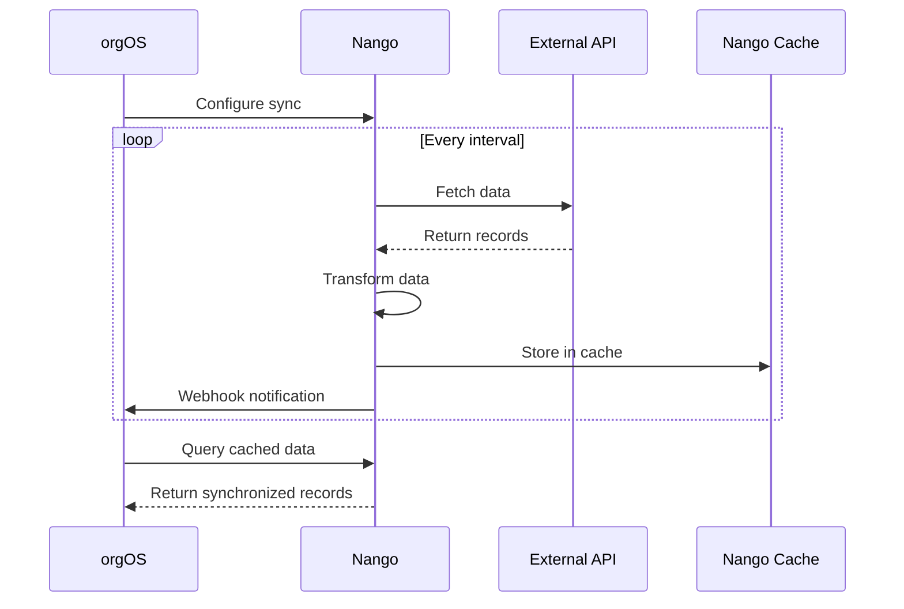

# Nango Integration Platform

<Alert className="mb-8">
  <AlertTitle>🚧 Work in Progress</AlertTitle>
  <AlertDescription>
    Nango integration is currently in **manual testing phase**. We're using it
    for authentication to 3rd party APIs only. Automatic data syncing features
    documented below are planned for future implementation.
  </AlertDescription>
</Alert>

## What is Nango?

Nango is a unified API integration platform that simplifies connecting to 250+ external services. It handles the complexity of OAuth flows, API authentication, rate limiting, pagination, and data synchronization - allowing developers to focus on business logic rather than integration infrastructure.

Think of Nango as your integration middleware that sits between your application and external APIs, providing:

- **Unified authentication** across OAuth 2.0, OAuth 1.0a, API keys, and basic auth
- **Managed connections** with automatic token refresh and credential storage
- **Data synchronization** with change detection and deletion tracking
- **Built-in resilience** including retries, rate limiting, and error handling

## Why We Use Nango

In orgOS, we leverage Nango to:

1. **Simplify API Authentication** - Handle complex OAuth flows without building custom implementations
2. **Manage Multiple Integrations** - Connect to various tools (Slack, GitHub, Google Workspace, etc.) through a single interface
3. **Ensure Data Consistency** - Future: Maintain synchronized data from external systems
4. **Scale Integrations** - Add new services without rewriting authentication and sync logic

### Integration Architecture



---

## Current Implementation

### Authentication Flow

Currently, we're using Nango primarily for managing OAuth connections to third-party services. Here's how it works:

```typescript
// 1. Initiate OAuth connection (client-side)
import Nango from '@nangohq/frontend';

const nango = new Nango({ publicKey: process.env.NEXT_PUBLIC_NANGO_PUBLIC_KEY });

// Start OAuth flow for a specific integration
await nango.auth('slack', 'user-123', {
  credentials: {
    oauth_client_id: 'your-client-id',
    oauth_client_secret: 'your-client-secret',
  }
});

// 2. Use the connection (server-side)
import { Nango } from '@nangohq/node';

const nango = new Nango({ secretKey: process.env.NANGO_SECRET_KEY });

// Make authenticated API calls
const response = await nango.proxy({
  providerConfigKey: 'slack',
  connectionId: 'user-123',
  method: 'GET',
  endpoint: '/users.info',
  params: { user: 'U123456' }
});
```

### Supported Integrations

We currently support authentication for:

- **Communication**: Slack, Microsoft Teams, Discord
- **Project Management**: Jira, Asana, Linear, Monday.com
- **Development**: GitHub, GitLab, Bitbucket
- **Cloud Storage**: Google Drive, Dropbox, OneDrive
- **CRM**: Salesforce, HubSpot, Pipedrive

<Alert>
  <AlertDescription>
    Integration availability depends on your Nango plan and configured
    providers. Check the Nango dashboard for active integrations.
  </AlertDescription>
</Alert>

---

## Future Roadmap: Data Syncing

<Badge variant="outline" className="mb-4">
  Planned Feature
</Badge>

### Sync Architecture

Once implemented, Nango syncs will continuously synchronize data from external APIs:



### Sync Types

**Incremental Sync**

- Fetches only changed records since last run
- More efficient for large datasets
- Requires API support for filtering by modification time

```typescript
// Example incremental sync implementation
export default async function sync(nango: NangoSync) {
  const lastSync = nango.lastSyncDate;

  // Fetch only records modified since last sync
  const records = await nango.get("/api/contacts", {
    params: {
      modifiedSince: lastSync?.toISOString(),
    },
  });

  await nango.batchSave(records);
}
```

**Full Refresh Sync**

- Retrieves entire dataset each execution
- Works with any API
- Automatically detects deletions

```typescript
// Example full refresh sync with deletion detection
export default async function sync(nango: NangoSync) {
  // Fetch all records
  const allRecords = await nango.paginate("/api/contacts");

  // Save and detect deletions automatically
  await nango.batchSave(allRecords);
  await nango.deleteRecordsFromPreviousExecutions();
}
```

### Data Models with Zod

Define type-safe schemas for synchronized data:

```typescript
import { z } from "zod";

// Define the data model
const Contact = z.object({
  id: z.string(),
  email: z.string().email(),
  firstName: z.string(),
  lastName: z.string(),
  company: z.string().optional(),
  createdAt: z.string().datetime(),
  customFields: z.record(z.unknown()).optional(),
});

// Use in sync function
export default async function sync(nango: NangoSync) {
  const rawData = await nango.get("/api/contacts");

  // Validate and transform
  const contacts = rawData.map((item) => Contact.parse(transformContact(item)));

  await nango.batchSave(contacts);
}
```

---

## Best Practices & Common Pitfalls

### Integration Development Checklist

Before deploying any integration:

<Card className="mb-6">
  <CardContent className="pt-6">
    <div className="space-y-2">
      <div className="flex items-center gap-2">
        <Badge variant="outline">✓</Badge>
        <span>Verify API endpoints against official documentation</span>
      </div>
      <div className="flex items-center gap-2">
        <Badge variant="outline">✓</Badge>
        <span>Implement comprehensive error handling for API failures</span>
      </div>
      <div className="flex items-center gap-2">
        <Badge variant="outline">✓</Badge>
        <span>Add input validation using Zod schemas</span>
      </div>
      <div className="flex items-center gap-2">
        <Badge variant="outline">✓</Badge>
        <span>Test pagination for large datasets</span>
      </div>
      <div className="flex items-center gap-2">
        <Badge variant="outline">✓</Badge>
        <span>Remove all debugging code and console.logs</span>
      </div>
      <div className="flex items-center gap-2">
        <Badge variant="outline">✓</Badge>
        <span>Run `nango dryrun` to test locally</span>
      </div>
      <div className="flex items-center gap-2">
        <Badge variant="outline">✓</Badge>
        <span>Monitor memory/CPU with `--diagnostics` flag</span>
      </div>
    </div>
  </CardContent>
</Card>

### Common Pitfalls to Avoid

<Alert variant="destructive" className="mb-4">
  <AlertTitle>⚠️ API Knowledge Gaps</AlertTitle>
  <AlertDescription>
    Always verify endpoint availability and parameters against actual API
    documentation. Don't assume endpoints exist based on common patterns.
  </AlertDescription>
</Alert>

<Alert variant="destructive" className="mb-4">
  <AlertTitle>⚠️ Deletion Detection Errors</AlertTitle>
  <AlertDescription>
    Never swallow exceptions in sync functions. Uncaught errors prevent deletion
    detection, potentially causing false positives where valid records are
    marked as deleted.
  </AlertDescription>
</Alert>

<Alert variant="destructive" className="mb-4">
  <AlertTitle>⚠️ Rate Limit Violations</AlertTitle>
  <AlertDescription>
    While Nango handles rate limiting, be mindful of aggressive polling
    intervals. Start with conservative sync frequencies and adjust based on API
    limits and business needs.
  </AlertDescription>
</Alert>

### Performance Optimization

**Start Simple**
Begin with basic functionality before adding complex transformations or business logic.

**Batch Operations**
Use `batchSave()` instead of individual saves to reduce API calls and improve performance:

```typescript
// Good: Batch save
await nango.batchSave(records);

// Avoid: Individual saves in loops
for (const record of records) {
  await nango.save(record); // Don't do this!
}
```

**Memory Management**
For large datasets, process in chunks to avoid memory issues:

```typescript
// Process large datasets in chunks
const CHUNK_SIZE = 100;
let offset = 0;
let hasMore = true;

while (hasMore) {
  const chunk = await nango.get("/api/records", {
    params: { limit: CHUNK_SIZE, offset },
  });

  if (chunk.length > 0) {
    await nango.batchSave(chunk);
    offset += CHUNK_SIZE;
  } else {
    hasMore = false;
  }
}
```

---

## Testing & Deployment

### Local Development

```bash
# Install Nango CLI
npm install -g @nangohq/cli

# Initialize project
nango init

# Start development server
nango dev

# Test sync locally
nango dryrun salesforce-contacts

# Test with diagnostics
nango dryrun salesforce-contacts --diagnostics

# Deploy to production
nango deploy
```

### Environment Configuration

Required environment variables:

```bash
# .env.local
NANGO_SECRET_KEY=your-secret-key
NEXT_PUBLIC_NANGO_PUBLIC_KEY=your-public-key
NANGO_HOST=https://api.nango.dev  # or your self-hosted URL
```

### Integration Structure

Organize integrations following Nango's conventions:

```bash
nango-integrations/
├── salesforce/
│   ├── syncs/
│   │   ├── contacts.ts
│   │   └── opportunities.ts
│   └── actions/
│       └── create-lead.ts
├── slack/
│   ├── syncs/
│   │   └── messages.ts
│   └── webhooks/
│       └── message-received.ts
└── nango.yaml  # Integration configuration
```

---

## Platform Functions

Nango provides four types of functions for different integration needs:

<Card className="mb-4">
  <CardHeader>
    <CardTitle>Sync Functions</CardTitle>
  </CardHeader>
  <CardContent>
    Execute on schedule to synchronize data. Best for maintaining local copies
    of external data.
  </CardContent>
</Card>

<Card className="mb-4">
  <CardHeader>
    <CardTitle>Action Functions</CardTitle>
  </CardHeader>
  <CardContent>
    Trigger on-demand for operations like creating records or updating data in
    external systems.
  </CardContent>
</Card>

<Card className="mb-4">
  <CardHeader>
    <CardTitle>Webhook Functions</CardTitle>
  </CardHeader>
  <CardContent>
    Process incoming webhooks from external services for real-time event
    handling.
  </CardContent>
</Card>

<Card className="mb-4">
  <CardHeader>
    <CardTitle>Event Functions</CardTitle>
  </CardHeader>
  <CardContent>
    Respond to Nango platform events like connection creation or deletion.
  </CardContent>
</Card>

---

## References & Resources

### Official Documentation

- [Nango Integration Templates](https://github.com/NangoHQ/integration-templates/tree/main/integrations) - Pre-built templates for 130+ services
- [Sync Use Cases Guide](https://nango.dev/docs/guides/use-cases/syncs) - When and how to use syncs
- [Implementing Syncs](https://nango.dev/docs/implementation-guides/syncs/implement-a-sync) - Step-by-step sync implementation
- [AI Agent Best Practices](https://nango.dev/docs/implementation-guides/building-integrations/leverage-ai-agents#common-pitfalls-and-checklist) - Avoiding common integration pitfalls
- [Platform Functions](https://nango.dev/docs/guides/platform/functions) - Understanding function types
- [Deletion Detection](https://nango.dev/docs/implementation-guides/syncs/deletion-detection) - Handling deleted records in syncs

### Internal Resources

- Integration configurations: `/nango-integrations/`
- Environment setup: See `.env.example` for required variables
- Testing guide: Run `pnpm test:integrations` (when implemented)

<Alert className="mt-8">
  <AlertTitle>📚 Need Help?</AlertTitle>
  <AlertDescription>
    For questions about Nango integration, check the [Nango
    documentation](https://docs.nango.dev) or reach out to the platform team.
    For orgOS-specific implementation details, see our internal integration
    guides.
  </AlertDescription>
</Alert>
