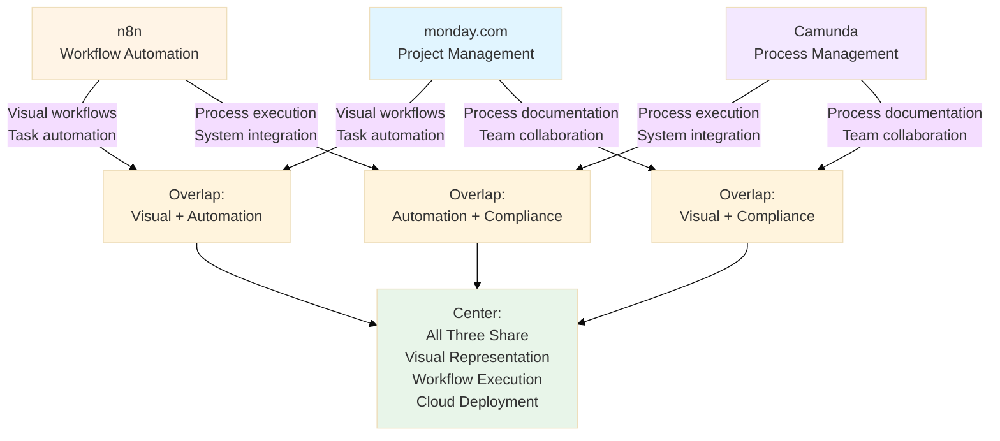
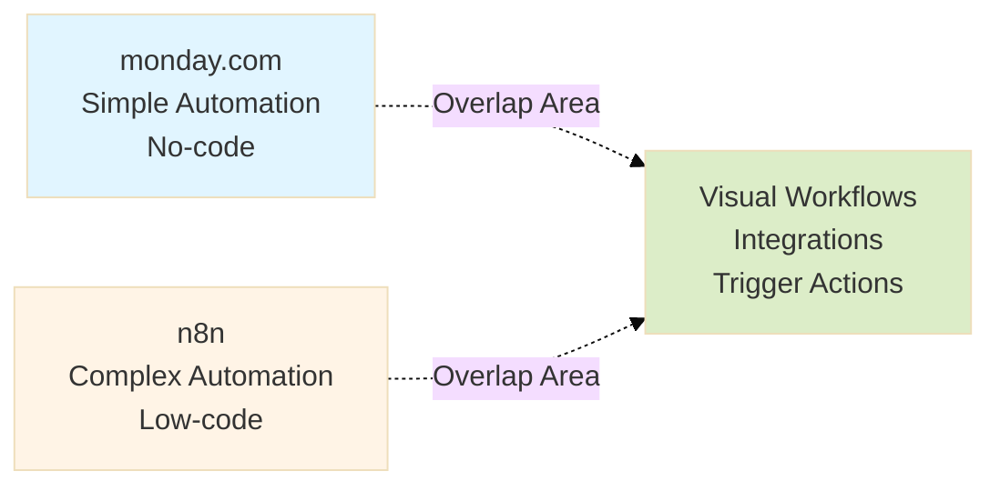
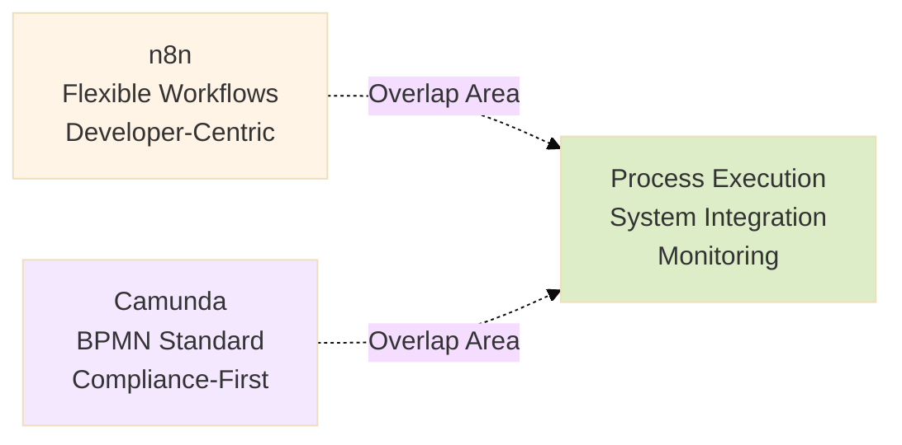
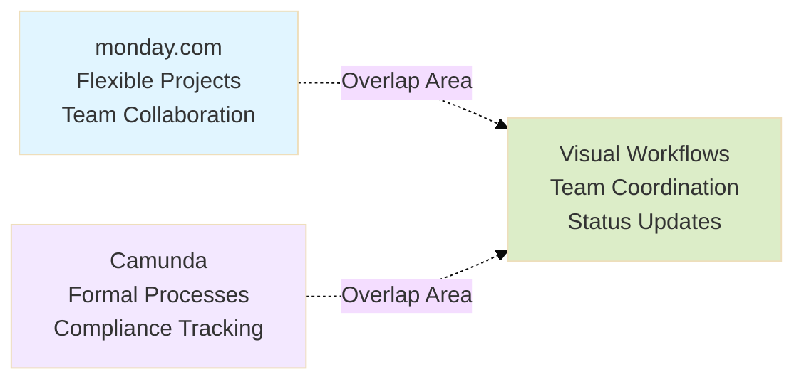
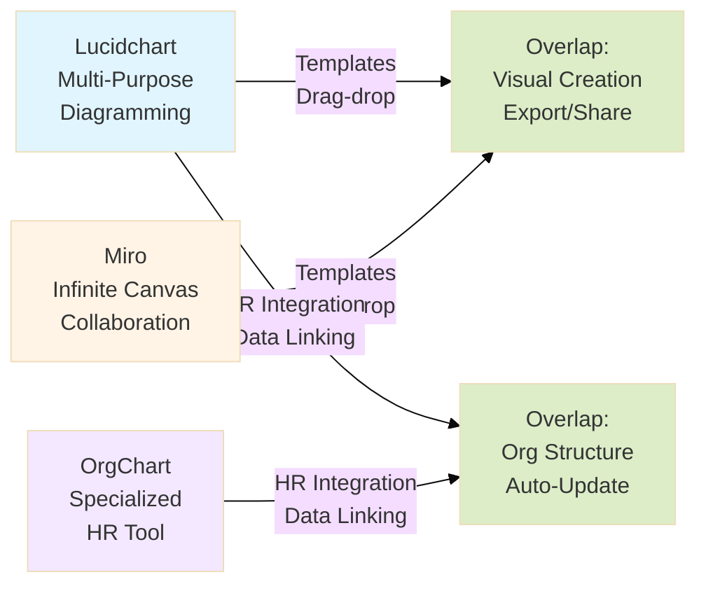

# Management Tools Market Research

A concise comparison of modern management tool categories and their overlapping features.

<Alert className="mb-8">
  <AlertDescription>
    This research compares three major tool categories: **Project Management**
    (monday.com), **Workflow Automation** (n8n), and **Business Process
    Management** (Camunda), plus organizational chart tools. Data current as of
    2024-2025.
  </AlertDescription>
</Alert>

---

## Tool Categories Overview

### 1. Project Management - monday.com

**What it does:** Visual work management platform for teams to plan, track, and deliver projects. Think colorful Kanban boards, Gantt charts, and task automation for business users.

**Best for:** Marketing campaigns, product launches, team collaboration, sales pipelines
**Market:** $16.3B valuation, 250K+ customers, 99% of Fortune 500
**Similar tools:** Asana, ClickUp, Trello, Jira

<Card className="mb-6">
  <CardContent className="pt-6">
    

      

        <strong>Founded:</strong> 2012
      

      

        <strong>Revenue:</strong> $972M (2024)
      

      

        <strong>User Type:</strong> Business users
      

      

        <strong>Pricing:</strong> $9-19/user/month
      

    

  </CardContent>
</Card>

---

### 2. Workflow Automation - n8n

**What it does:** Developer-friendly automation platform that connects apps and databases with visual workflows. Like Zapier but open-source, technical, and self-hostable.

**Best for:** API integration, data syncing, technical workflows, custom automation
**Market:** $2.5B valuation, 230K+ users, fast-growing
**Similar tools:** Zapier, Make (Integromat), Tray.io

<Card className="mb-6">
  <CardContent className="pt-6">
    

      

        <strong>Founded:</strong> 2019
      

      

        <strong>ARR:</strong> $40M (2025)
      

      

        <strong>User Type:</strong> Developers
      

      

        <strong>Pricing:</strong> Free-$50/month (execution-based)
      

    

  </CardContent>
</Card>

---

### 3. Business Process Management - Camunda

**What it does:** Enterprise process orchestration using BPMN 2.0 standard. Models, executes, and monitors complex business processes for compliance and scale.

**Best for:** Banking workflows, insurance claims, regulatory compliance, enterprise processes
**Market:** $68M revenue (+111% YoY), 400+ enterprise customers
**Similar tools:** Pega, Appian, Bizagi, Signavio

<Card className="mb-6">
  <CardContent className="pt-6">
    

      

        <strong>Founded:</strong> 2008
      

      

        <strong>Revenue:</strong> $68M (2024)
      

      

        <strong>User Type:</strong> Business analysts + Developers
      

      

        <strong>Pricing:</strong> Free-$50K+/year
      

    

  </CardContent>
</Card>

---

### 4. Organizational Chart Tools

**What they do:** Visualize company structure, reporting relationships, and organizational design. Some integrate with HR systems for auto-updates.

**Best for:** HR planning, workforce visualization, org design
**Leading tools:**

- **Lucidchart** - $210M revenue, multi-purpose diagramming
- **Miro** - $17.5B valuation, infinite canvas collaboration
- **OrgChart** - Specialized HR org chart software

---

## Comparison Table

| Feature              | monday.com                | n8n                          | Camunda                   |
| -------------------- | ------------------------- | ---------------------------- | ------------------------- |
| **Primary Use**      | Project & task management | Technical automation         | Process orchestration     |
| **Visual Interface** | Kanban, Gantt, Timeline   | Node-based workflows         | BPMN diagrams             |
| **Target Users**     | Business teams            | Developers, IT teams         | Enterprise, compliance    |
| **Automation**       | Simple triggers (no-code) | Complex workflows (low-code) | Process automation (BPMN) |
| **Integration**      | 100+ apps                 | 400+ nodes                   | API-based                 |
| **Compliance Focus** | ❌ Low                    | ❌ Low                       | ✅ High                   |
| **Self-Hosting**     | ❌ Cloud only             | ✅ Yes (open-source)         | ✅ Yes (enterprise)       |
| **Learning Curve**   | Easy                      | Medium                       | Hard                      |
| **Typical Cost**     | $12/user/month            | $50/month (10K runs)         | $50K+/year                |

---

## Use Case Matrix

### When to Use Each Tool

| Scenario                          | Recommended Tool        | Why                                     |
| --------------------------------- | ----------------------- | --------------------------------------- |
| Marketing team managing campaigns | **monday.com**          | Visual boards, easy collaboration       |
| Syncing data between 5+ systems   | **n8n**                 | Technical integration, API flexibility  |
| Bank loan approval process        | **Camunda**             | Compliance, audit trails, BPMN standard |
| Product team sprint planning      | **monday.com**          | Task tracking, timeline views           |
| Custom internal automation        | **n8n**                 | Self-hosted, code flexibility           |
| Insurance claims processing       | **Camunda**             | Complex process orchestration           |
| Sales pipeline tracking           | **monday.com**          | CRM features, visual pipeline           |
| Microservice orchestration        | **Camunda**             | Technical process management            |
| HR org chart planning             | **Lucidchart/OrgChart** | Specialized visualization               |

---

## Tool Overlaps: Venn Diagrams

### Three-Way Overlap Analysis

---

### Detailed Overlap: Project Management ∩ Workflow Automation

**Common Ground:**

- Trigger-based automation
- Visual workflow representation
- Third-party integrations
- Task automation

**Key Difference:**

- **monday.com**: Business-friendly, task-focused → "When card moves to Done, notify team"
- **n8n**: Developer-friendly, data-focused → "When lead enters CRM, enrich from 5 APIs, create tasks in 3 systems"

---

### Detailed Overlap: Workflow Automation ∩ Process Management

**Common Ground:**

- Process execution engines
- System orchestration
- Monitoring and logging
- API integrations

**Key Difference:**

- **n8n**: Flexible, rapid iteration → Developer builds custom workflow in hours
- **Camunda**: Formal, compliance-focused → Business analyst models BPMN process for audit

---

### Detailed Overlap: Project Management ∩ Process Management

**Common Ground:**

- Process documentation
- Team collaboration
- Workflow visualization
- Status tracking

**Key Difference:**

- **monday.com**: Ad-hoc, flexible → Change workflows anytime, no formal process
- **Camunda**: Structured, versioned → Process models with governance and compliance

---

## What Makes Each Unique

### monday.com's Differentiators

- ✅ **Easiest to use** - Drag-and-drop, colorful, intuitive
- ✅ **Business user focus** - No technical skills needed
- ✅ **Quick setup** - Templates for every industry
- ✅ **Team collaboration** - Built-in docs, forms, dashboards
- ❌ **Not for:** Complex technical automation, compliance processes

---

### n8n's Differentiators

- ✅ **Open-source** - Fair-code model, self-hostable
- ✅ **Developer-friendly** - Mix visual + custom code
- ✅ **400+ integrations** - Connect anything with APIs
- ✅ **Cost-effective** - Execution-based pricing, not seat-based
- ❌ **Not for:** Non-technical teams, simple task management

---

### Camunda's Differentiators

- ✅ **BPMN 2.0 standard** - Industry-standard process notation
- ✅ **Enterprise-grade** - Compliance, audit trails, governance
- ✅ **Process intelligence** - Analytics and optimization
- ✅ **Scalable orchestration** - Handle millions of process instances
- ❌ **Not for:** Quick projects, non-technical teams, small budgets

---

## Organizational Chart Tools Deep Dive

### Lucidchart

**Revenue:** $210M (2024) | **Users:** 130M+ | **Customers:** 99% Fortune 500

**What it does:** Multi-purpose diagramming tool that includes org charts, flowcharts, system architecture, and more. Integrates with HR systems for auto-updated org charts.

**Pricing:** $7.95-30/user/month

**Best for:** Teams needing both org charts AND other diagrams (processes, architecture, etc.)

---

### Miro

**Valuation:** $17.5B | **Users:** 35M+ | **Revenue:** $290M (2024)

**What it does:** Infinite canvas for visual collaboration. Org charts are just one use case among brainstorming, workshops, agile ceremonies, and design thinking.

**Pricing:** $8-16/user/month

**Best for:** Remote teams doing collaborative work (org charts are secondary to collaboration)

---

### OrgChart

**Employees:** 32 | **Pricing:** Custom (not public)

**What it does:** Specialized org chart software with 50+ HR system integrations. Focused exclusively on organizational structure, workforce planning, and scenario modeling.

**Best for:** HR teams needing sophisticated org chart features without other diagramming tools

---

## Visual Collaboration + Org Charts Overlap

---

## Market Trends (2024-2025)

### 1. AI Integration Everywhere

**All tools adding AI capabilities:**

- **monday.com**: AI credits for task creation, content generation
- **n8n**: Native LLM integrations, AI agents in workflows
- **Camunda**: AI Copilot for BPMN diagram generation

**Impact:** AI is table stakes, not a differentiator anymore.

---

### 2. Low-Code/No-Code Movement

**Trend:** Democratize automation without IT dependency

- **monday.com**: Work OS for building custom apps without code
- **n8n**: Visual workflows with optional code escapes
- **Camunda**: Visual modeler for business analysts

**Impact:** Faster implementation, less IT bottleneck

---

### 3. Execution-Based Pricing

**Shift from seat-based to usage-based:**

- **n8n**: Moved to execution-based pricing in 2025
- **monday.com**: Still seat-based but with usage limits
- **Camunda**: Hybrid model

**Impact:** More predictable costs aligned with actual usage

---

## Quick Reference

| Category                  | Market Size (2025) | CAGR        | Example Tools              |
| ------------------------- | ------------------ | ----------- | -------------------------- |
| **Project Management**    | $9.76B             | 15.65%      | monday.com, Asana, ClickUp |
| **Workflow Automation**   | $23.77B            | 9.52-23.68% | n8n, Zapier, Make          |
| **Business Process Mgmt** | $16.73-21.51B      | 11.83-18.6% | Camunda, Pega, Appian      |
| **Visual Collaboration**  | $2.51B             | 20.85%      | Miro, Lucidchart, FigJam   |

---

## Decision Framework

### Choose monday.com if:

- ✅ Your team is non-technical (marketing, operations, sales)
- ✅ You need quick setup with templates
- ✅ Visual task tracking is primary goal
- ✅ Budget: $10-20/user/month

### Choose n8n if:

- ✅ You have developers or technical team
- ✅ You need custom API integrations
- ✅ Self-hosting is important (data sovereignty)
- ✅ Budget: $50-200/month for cloud, or free self-hosted

### Choose Camunda if:

- ✅ You're in regulated industry (banking, healthcare, insurance)
- ✅ Compliance and audit trails are critical
- ✅ You need process governance and versioning
- ✅ Budget: $50K+/year for enterprise

### Choose Org Chart Tools if:

- ✅ **Lucidchart**: Need org charts + other diagrams
- ✅ **Miro**: Prioritize collaboration over org charts
- ✅ **OrgChart**: HR-focused with deep workforce planning

---

## Conclusion

The management tools landscape offers specialized solutions for different needs:

- **For teams:** monday.com makes work visual and collaborative
- **For developers:** n8n connects systems with flexible automation
- **For enterprises:** Camunda orchestrates compliant business processes
- **For HR:** Dedicated org chart tools visualize organizational structure

**Key Insight:** The market is splitting into platform consolidation (all-in-one like monday.com) vs. best-of-breed integration (specialized tools connected via n8n).

**Future Direction:** All categories converging on AI, low-code, and visual interfaces—but core use cases remain distinct.

---

**Research Date:** November 9, 2025
**Data Sources:** Company websites, financial reports, industry analysts
