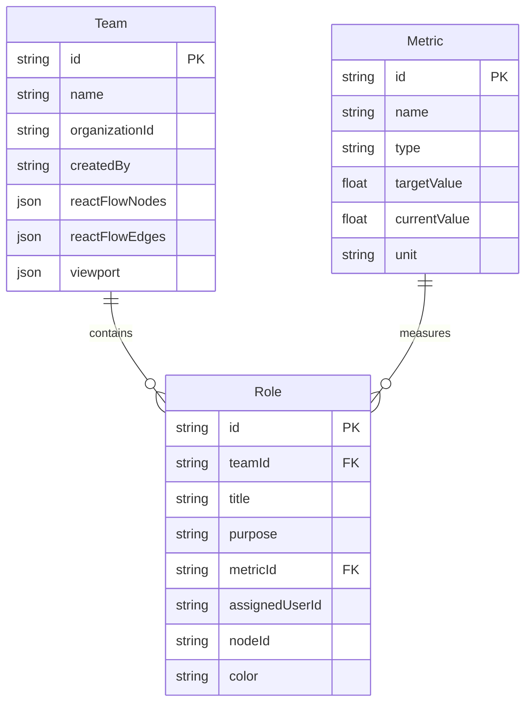
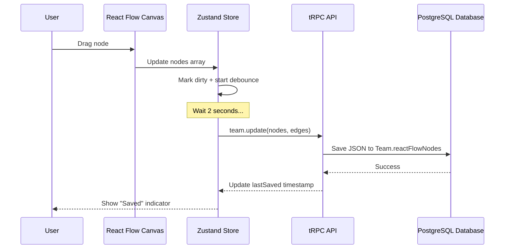

# Team Role Management System - Implementation Plan

## Overview

Build a team-based role management system where:

- **One Workflow = One Team** (each workflow is a React Flow canvas)
- **Each Team has Many Roles** (role nodes on the canvas)
- **Each Role has One Metric** (one-to-one relationship)
- **One Metric can be shared by Many Roles** (one-to-many relationship)
- Users can create multiple workflows (teams) per organization
- Organization members can edit any workflow within their org

---

## Database Schema Design

### Prisma Models

#### Team Model (Represents a React Flow Canvas)

```prisma
model Team {
  id             String   @id @default(cuid())
  name           String
  description    String?
  organizationId String   // WorkOS organization ID
  createdBy      String   // WorkOS user ID

  // Store React Flow state as JSON
  reactFlowNodes Json     // Array of RF nodes with positions
  reactFlowEdges Json     // Array of RF edges
  viewport       Json?    // { x, y, zoom } for canvas position

  roles          Role[]

  createdAt      DateTime @default(now())
  updatedAt      DateTime @updatedAt

  @@index([organizationId])
  @@index([createdBy])
}
```

**Design Rationale:**

- Store complete React Flow state (nodes + edges) as JSON for simplicity
- Avoids complex normalization while maintaining queryability
- Easy to serialize/deserialize entire canvas state
- `viewport` stores canvas zoom and pan state for UX consistency

#### Role Model (Represents a Role Node)

```prisma
model Role {
  id             String   @id @default(cuid())
  teamId         String

  // Role properties (user-defined)
  title          String
  purpose        String   @db.Text
  metricId       String   // References Metric (one-to-one from Role perspective)

  // Optional assignment
  assignedUserId String?  // WorkOS user ID

  // Visual properties (synced with React Flow node)
  nodeId         String   // React Flow node ID (for syncing)
  color          String   @default("#3b82f6") // Hex color

  team           Team     @relation(fields: [teamId], references: [id], onDelete: Cascade)
  metric         Metric   @relation(fields: [metricId], references: [id])

  createdAt      DateTime @default(now())
  updatedAt      DateTime @updatedAt

  @@index([teamId])
  @@index([metricId])
  @@index([assignedUserId])
}
```

**Design Rationale:**

- `nodeId` links database record to React Flow node for two-way sync
- `purpose` uses `@db.Text` for longer descriptions
- `color` enables visual distinction on canvas
- Cascade delete ensures roles are removed when team is deleted
- Indexes on foreign keys optimize queries

#### Metric Model (Represents Performance KPIs)

```prisma
model Metric {
  id             String   @id @default(cuid())
  name           String   // e.g., "Customer Satisfaction", "Response Time"
  description    String?

  // KPI properties
  type           String   // "percentage", "number", "duration", etc.
  targetValue    Float?   // Target threshold
  currentValue   Float?   // Current value (mock data)
  unit           String?  // "ms", "%", "requests", etc.

  // Mock data generation
  mockDataPrompt String?  @db.Text // AI prompt for generating mock data

  roles          Role[]   // One metric can be used by many roles

  createdAt      DateTime @default(now())
  updatedAt      DateTime @updatedAt

  @@index([name])
}
```

**Design Rationale:**

- One metric can be shared across multiple roles (one-to-many)
- `mockDataPrompt` stores AI prompt for regenerating realistic data
- Flexible `type` field supports various KPI formats
- `currentValue` stores AI-generated mock data for demonstration

### Entity Relationship Diagram



### Key Design Decisions

1. **Team = Workflow Canvas**
   - Each Team stores complete React Flow state (nodes + edges) as JSON
   - Avoids complex normalization while maintaining queryability
   - Easy to serialize/deserialize entire canvas

2. **Role ↔ Metric Relationship**
   - Role has `metricId` (one role → one metric)
   - Metric has `roles[]` array (one metric → many roles)
   - Allows metric reuse across multiple roles

3. **WorkOS Integration**
   - Store only IDs (`organizationId`, `userId`) in Prisma
   - Fetch user/org details from WorkOS API on-demand
   - No duplication of WorkOS data

4. **React Flow Syncing**
   - Role stores `nodeId` to link DB record ↔ RF node
   - Node data includes `roleId` to fetch Role details
   - Edges stored as JSON (no separate table needed)

---

## React Flow Data Storage Strategy

### Data Flow Architecture



### What Gets Stored

#### In Database (Team.reactFlowNodes JSON)

```json
[
  {
    "id": "role-node-1",
    "type": "role-node",
    "position": { "x": 100, "y": 200 },
    "data": {
      "roleId": "clx123abc",
      "title": "Product Manager",
      "color": "#3b82f6"
    }
  },
  {
    "id": "role-node-2",
    "type": "role-node",
    "position": { "x": 300, "y": 200 },
    "data": {
      "roleId": "clx456def",
      "title": "Software Engineer",
      "color": "#10b981"
    }
  }
]
```

#### In Database (Team.reactFlowEdges JSON)

```json
[
  {
    "id": "edge-1",
    "source": "role-node-1",
    "target": "role-node-2",
    "sourceHandle": "bottom",
    "targetHandle": "top",
    "type": "workflow",
    "animated": true
  }
]
```

#### In Database (Role table)

Each role stores:

- Full role details (title, purpose, metricId)
- Assignment data (assignedUserId)
- Reference back to node (nodeId)
- Visual properties (color)

### Sync Strategy

#### 1. On Load (Initial Hydration)

```typescript
// Fetch team with all roles via tRPC
const team = await api.team.getById.query({ id: teamId });

// Hydrate Zustand store
store.setState({
  nodes: team.reactFlowNodes,
  edges: team.reactFlowEdges,
  viewport: team.viewport,
  roles: new Map(team.roles.map((r) => [r.nodeId, r])),
});

// Enrich node data with role details
const enrichedNodes = nodes.map((node) => ({
  ...node,
  data: {
    ...node.data,
    ...roles.get(node.id), // Merge role data
  },
}));
```

#### 2. On Edit (Node Movement)

```typescript
// User drags node
onNodesChange(changes) {
  // Update Zustand immediately (optimistic)
  applyNodeChanges(changes, store.nodes);

  // Mark as dirty
  store.isDirty = true;

  // Debounced save (2s after last change)
  clearTimeout(saveTimeout);
  saveTimeout = setTimeout(() => {
    api.team.update.mutate({
      id: teamId,
      reactFlowNodes: store.nodes,
      reactFlowEdges: store.edges,
    });
  }, 2000);
}
```

#### 3. On Role Data Edit

```typescript
// User edits role properties
const updateRole = async (roleId, updates) => {
  // Update via separate mutation
  await api.role.update.mutate({ id: roleId, ...updates });

  // Invalidate team query to refresh
  utils.team.getById.invalidate({ id: teamId });

  // Update node data in Zustand (optimistic)
  const node = store.nodes.find((n) => n.data.roleId === roleId);
  if (node) {
    node.data = { ...node.data, ...updates };
  }
};
```

#### 4. Conflict Resolution

```typescript
// Before saving
const currentTeam = await api.team.getById.query({ id: teamId });

if (currentTeam.updatedAt > store.lastLoadedAt) {
  // Another user saved more recently
  showConflictDialog({
    message: "This team was modified by another user",
    options: ["Reload", "Overwrite"],
  });
}
```

### Storage Optimization

**Limits:**

- Max 100 nodes per team (warn at 80)
- Max 500 edges per team
- JSON size limit: 10 MB

**Compression:**

- Store only essential node data in JSON
- Fetch full role details on demand
- Cache role data in Zustand

---

## API Layer (tRPC Routers)

### Team Router (`server/api/routers/team.ts`)

```typescript
export const teamRouter = createTRPCRouter({
  // Get all teams for user's organization
  getAll: protectedProcedure.query(async ({ ctx }) => {
    const memberships = await workos.userManagement.listOrganizationMemberships(
      {
        userId: ctx.user.id,
        limit: 1,
      },
    );

    if (!memberships.data[0]) return [];

    return ctx.db.team.findMany({
      where: { organizationId: memberships.data[0].organizationId },
      include: {
        _count: { select: { roles: true } },
      },
      orderBy: { updatedAt: "desc" },
    });
  }),

  // Get single team with all roles and metrics
  getById: protectedProcedure
    .input(z.object({ id: z.string() }))
    .query(async ({ ctx, input }) => {
      const team = await ctx.db.team.findUnique({
        where: { id: input.id },
        include: {
          roles: {
            include: { metric: true },
          },
        },
      });

      if (!team) {
        throw new TRPCError({ code: "NOT_FOUND" });
      }

      // Authorization: Check org membership
      const memberships =
        await workos.userManagement.listOrganizationMemberships({
          userId: ctx.user.id,
          organizationId: team.organizationId,
        });

      if (!memberships.data.length) {
        throw new TRPCError({ code: "FORBIDDEN" });
      }

      return team;
    }),

  // Create new team
  create: protectedProcedure
    .input(
      z.object({
        name: z.string().min(1).max(100),
        description: z.string().optional(),
      }),
    )
    .mutation(async ({ ctx, input }) => {
      const memberships =
        await workos.userManagement.listOrganizationMemberships({
          userId: ctx.user.id,
          limit: 1,
        });

      if (!memberships.data[0]) {
        throw new TRPCError({
          code: "FORBIDDEN",
          message: "Must belong to an organization",
        });
      }

      return ctx.db.team.create({
        data: {
          name: input.name,
          description: input.description,
          organizationId: memberships.data[0].organizationId,
          createdBy: ctx.user.id,
          reactFlowNodes: [],
          reactFlowEdges: [],
        },
        include: { roles: true },
      });
    }),

  // Update team (name, canvas state, etc.)
  update: protectedProcedure
    .input(
      z.object({
        id: z.string(),
        name: z.string().optional(),
        description: z.string().optional(),
        reactFlowNodes: z.any().optional(),
        reactFlowEdges: z.any().optional(),
        viewport: z.any().optional(),
      }),
    )
    .mutation(async ({ ctx, input }) => {
      // Verify ownership/membership
      const team = await ctx.db.team.findUnique({
        where: { id: input.id },
      });

      if (!team) {
        throw new TRPCError({ code: "NOT_FOUND" });
      }

      const memberships =
        await workos.userManagement.listOrganizationMemberships({
          userId: ctx.user.id,
          organizationId: team.organizationId,
        });

      if (!memberships.data.length) {
        throw new TRPCError({ code: "FORBIDDEN" });
      }

      const { id, ...data } = input;
      return ctx.db.team.update({
        where: { id },
        data,
        include: { roles: { include: { metric: true } } },
      });
    }),

  // Delete team
  delete: protectedProcedure
    .input(z.object({ id: z.string() }))
    .mutation(async ({ ctx, input }) => {
      // Similar authorization checks...

      await ctx.db.team.delete({
        where: { id: input.id },
      });

      return { success: true };
    }),
});
```

### Role Router (`server/api/routers/role.ts`)

```typescript
export const roleRouter = createTRPCRouter({
  // Create new role
  create: protectedProcedure
    .input(
      z.object({
        teamId: z.string(),
        title: z.string().min(1).max(100),
        purpose: z.string().min(1),
        metricId: z.string(),
        nodeId: z.string(),
        color: z
          .string()
          .regex(/^#[0-9A-F]{6}$/i)
          .optional(),
      }),
    )
    .mutation(async ({ ctx, input }) => {
      // Verify user has access to team
      const team = await ctx.db.team.findUnique({
        where: { id: input.teamId },
      });

      if (!team) {
        throw new TRPCError({ code: "NOT_FOUND" });
      }

      // Check org membership
      const memberships =
        await workos.userManagement.listOrganizationMemberships({
          userId: ctx.user.id,
          organizationId: team.organizationId,
        });

      if (!memberships.data.length) {
        throw new TRPCError({ code: "FORBIDDEN" });
      }

      return ctx.db.role.create({
        data: input,
        include: { metric: true },
      });
    }),

  // Update role
  update: protectedProcedure
    .input(
      z.object({
        id: z.string(),
        title: z.string().optional(),
        purpose: z.string().optional(),
        metricId: z.string().optional(),
        assignedUserId: z.string().optional(),
        color: z.string().optional(),
      }),
    )
    .mutation(async ({ ctx, input }) => {
      // Fetch role to verify team access
      const role = await ctx.db.role.findUnique({
        where: { id: input.id },
        include: { team: true },
      });

      if (!role) {
        throw new TRPCError({ code: "NOT_FOUND" });
      }

      // Check org membership
      const memberships =
        await workos.userManagement.listOrganizationMemberships({
          userId: ctx.user.id,
          organizationId: role.team.organizationId,
        });

      if (!memberships.data.length) {
        throw new TRPCError({ code: "FORBIDDEN" });
      }

      const { id, ...data } = input;
      return ctx.db.role.update({
        where: { id },
        data,
        include: { metric: true },
      });
    }),

  // Delete role
  delete: protectedProcedure
    .input(z.object({ id: z.string() }))
    .mutation(async ({ ctx, input }) => {
      // Authorization checks...

      await ctx.db.role.delete({
        where: { id: input.id },
      });

      return { success: true };
    }),

  // Assign user to role
  assignUser: protectedProcedure
    .input(
      z.object({
        roleId: z.string(),
        userId: z.string(),
      }),
    )
    .mutation(async ({ ctx, input }) => {
      // Verify role exists and user has access
      const role = await ctx.db.role.findUnique({
        where: { id: input.roleId },
        include: { team: true },
      });

      if (!role) {
        throw new TRPCError({ code: "NOT_FOUND" });
      }

      // Verify both current user and assigned user belong to org
      const [currentUserMemberships, assignedUserMemberships] =
        await Promise.all([
          workos.userManagement.listOrganizationMemberships({
            userId: ctx.user.id,
            organizationId: role.team.organizationId,
          }),
          workos.userManagement.listOrganizationMemberships({
            userId: input.userId,
            organizationId: role.team.organizationId,
          }),
        ]);

      if (!currentUserMemberships.data.length) {
        throw new TRPCError({ code: "FORBIDDEN" });
      }

      if (!assignedUserMemberships.data.length) {
        throw new TRPCError({
          code: "BAD_REQUEST",
          message: "User is not a member of this organization",
        });
      }

      return ctx.db.role.update({
        where: { id: input.roleId },
        data: { assignedUserId: input.userId },
        include: { metric: true },
      });
    }),

  // Get all roles for a team
  getByTeam: protectedProcedure
    .input(z.object({ teamId: z.string() }))
    .query(async ({ ctx, input }) => {
      // Authorization checks...

      return ctx.db.role.findMany({
        where: { teamId: input.teamId },
        include: { metric: true },
        orderBy: { createdAt: "asc" },
      });
    }),
});
```

### Metric Router (`server/api/routers/metric.ts`)

```typescript
export const metricRouter = createTRPCRouter({
  // Get all metrics
  getAll: protectedProcedure.query(async ({ ctx }) => {
    return ctx.db.metric.findMany({
      orderBy: { name: "asc" },
    });
  }),

  // Create new metric
  create: protectedProcedure
    .input(
      z.object({
        name: z.string().min(1).max(100),
        description: z.string().optional(),
        type: z.enum(["percentage", "number", "duration", "rate"]),
        targetValue: z.number().optional(),
        unit: z.string().optional(),
      }),
    )
    .mutation(async ({ ctx, input }) => {
      return ctx.db.metric.create({
        data: input,
      });
    }),

  // Update metric
  update: protectedProcedure
    .input(
      z.object({
        id: z.string(),
        name: z.string().optional(),
        description: z.string().optional(),
        targetValue: z.number().optional(),
        currentValue: z.number().optional(),
      }),
    )
    .mutation(async ({ ctx, input }) => {
      const { id, ...data } = input;
      return ctx.db.metric.update({
        where: { id },
        data,
      });
    }),

  // Generate mock data using AI
  generateMockData: protectedProcedure
    .input(z.object({ id: z.string() }))
    .mutation(async ({ ctx, input }) => {
      const metric = await ctx.db.metric.findUnique({
        where: { id: input.id },
      });

      if (!metric) {
        throw new TRPCError({ code: "NOT_FOUND" });
      }

      // Generate mock value using AI (Claude via OpenRouter or direct API)
      const prompt = `Generate a realistic ${metric.type} value for the metric "${metric.name}". ${metric.description || ""}. Target: ${metric.targetValue || "none"}. Return only the numeric value.`;

      // Call AI service (simplified)
      const mockValue = await generateWithAI(prompt);

      return ctx.db.metric.update({
        where: { id: input.id },
        data: {
          currentValue: parseFloat(mockValue),
          mockDataPrompt: prompt,
        },
      });
    }),

  // Delete metric (only if not used)
  delete: protectedProcedure
    .input(z.object({ id: z.string() }))
    .mutation(async ({ ctx, input }) => {
      // Check if metric is used by any roles
      const rolesUsingMetric = await ctx.db.role.count({
        where: { metricId: input.id },
      });

      if (rolesUsingMetric > 0) {
        throw new TRPCError({
          code: "BAD_REQUEST",
          message: `Cannot delete metric. It is used by ${rolesUsingMetric} role(s).`,
        });
      }

      await ctx.db.metric.delete({
        where: { id: input.id },
      });

      return { success: true };
    }),
});
```

### Authorization Pattern Summary

All routers follow this pattern:

1. Fetch resource from database
2. Check user's organization membership via WorkOS
3. Verify user belongs to same organization as resource
4. Throw `FORBIDDEN` error if unauthorized

---

## Frontend Components

### Page Structure

```
app/
└── teams/
    ├── page.tsx                    // Team list view (/teams)
    ├── _components/
    │   ├── team-card.tsx
    │   ├── create-team-dialog.tsx
    │   └── delete-team-dialog.tsx
    └── [teamId]/
        ├── page.tsx                // Team canvas view (/teams/[id])
        ├── store/
        │   └── team-store.ts       // Zustand store
        └── _components/
            ├── team-canvas.tsx
            ├── role-sidebar.tsx
            ├── metric-selector.tsx
            ├── member-list.tsx
            ├── role-node.tsx
            ├── create-role-dialog.tsx
            ├── edit-role-dialog.tsx
            └── create-metric-dialog.tsx
```

### Component Breakdown

#### 1. Team List Page (`/teams`)

**Layout:**

```
┌─────────────────────────────────────────────────┐
│  Teams                         [+ New Team]     │
├─────────────────────────────────────────────────┤
│                                                 │
│  ┌────────────┐  ┌────────────┐  ┌────────────┐│
│  │ Team Alpha │  │ Team Beta  │  │ Team Gamma ││
│  │ 5 roles    │  │ 3 roles    │  │ 8 roles    ││
│  │ 2 hrs ago  │  │ 1 day ago  │  │ 3 days ago ││
│  └────────────┘  └────────────┘  └────────────┘│
│                                                 │
└─────────────────────────────────────────────────┘
```

**Features:**

- Grid layout of team cards
- Shows team name, role count, last updated time
- Click card to navigate to canvas
- "New Team" button opens creation dialog
- Delete icon on hover (with confirmation)

#### 2. Team Canvas Page (`/teams/[teamId]`)

**Layout:**

```
┌─────────────────────────────────────────────────┐
│  Team Alpha           [Auto-save: On] [Save]    │
├───────────┬─────────────────────────────────────┤
│           │                                     │
│  ROLES    │      React Flow Canvas             │
│  ────────│                                     │
│  • PM     │      ┌──────────────┐              │
│  • Dev    │      │  Product Mgr │              │
│  • QA     │      └──────┬───────┘              │
│           │             │                       │
│  + Add    │             ↓                       │
│           │      ┌──────────────┐              │
│  METRICS  │      │   Developer  │              │
│  ────────│      └──────┬───────┘              │
│  • Speed  │             │                       │
│  • Quality│             ↓                       │
│           │      ┌──────────────┐              │
│  + Add    │      │      QA      │              │
│           │      └──────────────┘              │
│  MEMBERS  │                                     │
│  ────────│                                     │
│  👤 John  │                                     │
│  👤 Jane  │                                     │
│           │                                     │
└───────────┴─────────────────────────────────────┘
```

#### 3. Role Node Component

**Visual Structure:**

```
┌────────────────────────────┐
│  👤  Product Manager       │ ← Title
├────────────────────────────┤
│  Purpose: Lead product...  │ ← Purpose (truncated)
│  📊 Customer Satisfaction  │ ← Metric
│  👤 @john                  │ ← Assigned user
└────────────────────────────┘
     ↑                  ↓
   Target           Source
   Handle           Handle
```

**Properties:**

- Title (bold, prominent)
- Purpose (truncated to 50 chars)
- Metric name with icon
- Assigned user (if any)
- Color border (customizable)
- Handles for connections

**Interactions:**

- Double-click to edit
- Right-click for context menu (edit, delete, assign)
- Drag to reposition
- Hover shows full purpose in tooltip

#### 4. Sidebar Components

**Role List:**

```tsx
<RoleSidebar>
  <SectionHeader>
    Roles
    <Button onClick={openCreateDialog}>+ Add</Button>
  </SectionHeader>

  <RoleList>
    {roles.map((role) => (
      <RoleItem
        key={role.id}
        role={role}
        onClick={() => focusNodeOnCanvas(role.nodeId)}
        onEdit={() => openEditDialog(role)}
        onDelete={() => deleteRole(role.id)}
      />
    ))}
  </RoleList>
</RoleSidebar>
```

**Metric Selector:**

```tsx
<MetricSelector>
  <Label>Select Metric</Label>
  <Select
    options={metrics}
    onChange={setSelectedMetric}
    renderOption={(metric) => (
      <div>
        <strong>{metric.name}</strong>
        <span>{metric.type}</span>
        <Badge>
          {metric.currentValue} {metric.unit}
        </Badge>
      </div>
    )}
  />
  <Button variant="link" onClick={openCreateMetricDialog}>
    + Create New Metric
  </Button>
</MetricSelector>
```

**Member List:**

```tsx
<MemberList>
  <SectionHeader>Organization Members</SectionHeader>

  {orgMembers.map((member) => (
    <MemberItem
      key={member.user.id}
      member={member}
      draggable
      onDragEnd={(userId) => assignToRole(userId)}
    >
      <Avatar src={member.user.profilePictureUrl} />
      <div>
        <Name>
          {member.user.firstName} {member.user.lastName}
        </Name>
        <Role>{member.membership.role}</Role>
      </div>
    </MemberItem>
  ))}
</MemberList>
```

#### 5. Dialogs

**Create/Edit Role Dialog:**

```tsx
<Dialog>
  <DialogHeader>{isEditing ? "Edit Role" : "Create Role"}</DialogHeader>

  <Form onSubmit={handleSubmit}>
    <Input
      label="Title"
      value={title}
      onChange={setTitle}
      placeholder="e.g., Product Manager"
    />

    <Textarea
      label="Purpose"
      value={purpose}
      onChange={setPurpose}
      rows={4}
      placeholder="Describe the role's responsibilities..."
    />

    <MetricSelector value={metricId} onChange={setMetricId} />

    <ColorPicker label="Node Color" value={color} onChange={setColor} />

    <UserSelector
      label="Assign to (optional)"
      value={assignedUserId}
      onChange={setAssignedUserId}
      options={orgMembers}
    />

    <DialogFooter>
      <Button variant="outline" onClick={close}>
        Cancel
      </Button>
      <Button type="submit">
        {isEditing ? "Save Changes" : "Create Role"}
      </Button>
    </DialogFooter>
  </Form>
</Dialog>
```

**Create/Edit Metric Dialog:**

```tsx
<Dialog>
  <DialogHeader>{isEditing ? "Edit Metric" : "Create Metric"}</DialogHeader>

  <Form onSubmit={handleSubmit}>
    <Input
      label="Name"
      value={name}
      placeholder="e.g., Customer Satisfaction"
    />

    <Textarea label="Description" value={description} rows={2} />

    <Select
      label="Type"
      value={type}
      options={["percentage", "number", "duration", "rate"]}
    />

    <Input type="number" label="Target Value" value={targetValue} />

    <Input label="Unit" value={unit} placeholder="e.g., %, ms, requests" />

    {isEditing && (
      <Button
        variant="secondary"
        onClick={generateMockData}
        loading={isGenerating}
      >
        🤖 Generate Mock Data
      </Button>
    )}

    <DialogFooter>
      <Button variant="outline" onClick={close}>
        Cancel
      </Button>
      <Button type="submit">
        {isEditing ? "Save Changes" : "Create Metric"}
      </Button>
    </DialogFooter>
  </Form>
</Dialog>
```

---

## State Management

### Zustand Store Structure

```typescript
// src/app/teams/[teamId]/store/team-store.ts
import type { Metric, Role } from "@prisma/client";
import type { Edge, Node, Viewport } from "@xyflow/react";
import { create } from "zustand";

type RoleNodeData = {
  roleId: string;
  title: string;
  purpose: string;
  metric: Metric;
  assignedUser?: {
    id: string;
    name: string;
    email: string;
  };
  color: string;
};

type AppNode = Node<RoleNodeData, "role-node">;
type AppEdge = Edge;

type TeamState = {
  // React Flow state
  nodes: AppNode[];
  edges: AppEdge[];
  viewport: Viewport;

  // Team metadata
  teamId: string;
  teamName: string;
  organizationId: string;

  // Role data (from DB)
  roles: Map<string, Role & { metric: Metric }>; // Key: nodeId
  metrics: Map<string, Metric>; // Key: metricId

  // UI state
  isDirty: boolean;
  lastSaved: Date | null;
  isAutoSaving: boolean;
  selectedRoleId: string | null;

  // Loading states
  isLoading: boolean;
  isSaving: boolean;
};

type TeamActions = {
  // React Flow actions
  onNodesChange: (changes: NodeChange[]) => void;
  onEdgesChange: (changes: EdgeChange[]) => void;
  onConnect: (connection: Connection) => void;
  setViewport: (viewport: Viewport) => void;

  // Team management
  loadTeam: (teamId: string) => Promise<void>;
  saveTeam: () => Promise<void>;
  setTeamName: (name: string) => void;

  // Role management
  createRole: (data: CreateRoleInput) => Promise<void>;
  updateRole: (roleId: string, data: UpdateRoleInput) => Promise<void>;
  deleteRole: (roleId: string) => Promise<void>;
  selectRole: (roleId: string) => void;
  focusRole: (roleId: string) => void;

  // Assignment
  assignUserToRole: (roleId: string, userId: string) => Promise<void>;

  // Auto-save
  markDirty: () => void;
  startAutoSave: () => void;
  stopAutoSave: () => void;
};

type TeamStore = TeamState & TeamActions;
```

### Store Implementation Highlights

#### Auto-Save Logic

```typescript
let saveTimeout: NodeJS.Timeout;

const markDirty = () => {
  set({ isDirty: true });

  // Debounce: save 2 seconds after last change
  clearTimeout(saveTimeout);
  saveTimeout = setTimeout(() => {
    get().saveTeam();
  }, 2000);
};

const onNodesChange = (changes) => {
  const { nodes } = get();
  const nextNodes = applyNodeChanges(changes, nodes);

  set({ nodes: nextNodes });
  markDirty();
};
```

#### Load Team

```typescript
const loadTeam = async (teamId: string) => {
  set({ isLoading: true });

  try {
    const team = await api.team.getById.query({ id: teamId });

    // Build role and metric maps
    const roles = new Map(team.roles.map((role) => [role.nodeId, role]));
    const metrics = new Map(
      team.roles.map((role) => [role.metric.id, role.metric]),
    );

    // Enrich nodes with role data
    const enrichedNodes = team.reactFlowNodes.map((node) => ({
      ...node,
      data: {
        ...node.data,
        ...roles.get(node.id),
      },
    }));

    set({
      teamId: team.id,
      teamName: team.name,
      organizationId: team.organizationId,
      nodes: enrichedNodes,
      edges: team.reactFlowEdges,
      viewport: team.viewport,
      roles,
      metrics,
      lastSaved: team.updatedAt,
      isDirty: false,
    });
  } catch (error) {
    console.error("Failed to load team:", error);
  } finally {
    set({ isLoading: false });
  }
};
```

#### Save Team

```typescript
const saveTeam = async () => {
  const { teamId, teamName, nodes, edges, viewport } = get();

  set({ isSaving: true, isAutoSaving: true });

  try {
    await api.team.update.mutate({
      id: teamId,
      name: teamName,
      reactFlowNodes: nodes,
      reactFlowEdges: edges,
      viewport,
    });

    set({
      isDirty: false,
      lastSaved: new Date(),
    });
  } catch (error) {
    console.error("Failed to save team:", error);
    // Show error toast
  } finally {
    set({ isSaving: false, isAutoSaving: false });
  }
};
```

---

## User Flows

### Flow 1: Create New Team

1. User navigates to `/teams`
2. Clicks "New Team" button
3. Modal opens with form:
   - Team name (required)
   - Description (optional)
4. User fills form and clicks "Create"
5. tRPC mutation creates team in database
6. User navigated to `/teams/[newTeamId]`
7. Empty canvas displayed with sidebar

**Success:** User sees empty canvas ready for role creation

### Flow 2: Add First Role

1. User clicks "Add Role" in sidebar
2. Dialog opens with form
3. User enters:
   - Title: "Product Manager"
   - Purpose: "Lead product strategy..."
   - Clicks "Create Metric" → new dialog
   - Creates metric: "User Satisfaction" (percentage, target: 85)
   - Selects newly created metric
   - Picks color: blue
4. User clicks "Create Role"
5. System:
   - Creates Role in database
   - Generates nodeId
   - Creates React Flow node
   - Adds to canvas at center
6. Node appears on canvas
7. Auto-save triggered

**Success:** Role node visible on canvas, saved to database

### Flow 3: Connect Roles with Edges

1. User has 2+ role nodes on canvas
2. User drags from bottom handle of "Product Manager" node
3. Hovers over top handle of "Engineer" node
4. Releases mouse
5. System:
   - Creates edge in Zustand store
   - Renders animated edge
   - Marks state as dirty
   - Triggers auto-save (2s debounce)
6. Edge persisted to database

**Success:** Visual connection between roles, saved to DB

### Flow 4: Assign User to Role

**Method 1: Drag and Drop**

1. User sees "John Doe" in Members sidebar
2. User drags member onto "Product Manager" node
3. Node highlights on hover
4. User releases mouse
5. System:
   - Calls `assignUserToRole` mutation
   - Updates node data
   - Shows "John Doe" on node
6. Assignment saved

**Method 2: Dialog**

1. User double-clicks role node
2. Edit dialog opens
3. User selects "John Doe" from "Assign to" dropdown
4. Clicks "Save"
5. System updates assignment
6. Node reflects change

**Success:** User assigned, visible on node

### Flow 5: Edit Role Properties

1. User double-clicks role node (or clicks edit in sidebar)
2. Dialog opens with current values:
   - Title: "Product Manager"
   - Purpose: "Lead product..."
   - Metric: "User Satisfaction"
   - Assigned: "John Doe"
   - Color: blue
3. User changes title to "Senior Product Manager"
4. User changes metric to "Product Adoption Rate"
5. User clicks "Save Changes"
6. System:
   - Calls `role.update` mutation
   - Updates database
   - Invalidates team query
   - Updates node data in Zustand
7. Node updates on canvas

**Success:** Role updated, changes visible immediately

### Flow 6: Generate Mock Metric Data

1. User creates/edits metric "Response Time"
2. Fields:
   - Type: "duration"
   - Target: 200
   - Unit: "ms"
   - Current: (empty)
3. User clicks "Generate Mock Data" button
4. System:
   - Shows loading spinner
   - Calls `metric.generateMockData` mutation
   - Backend calls AI API with prompt
   - AI returns: "157"
   - Updates `currentValue` to 157
5. Dialog updates to show: Current: 157 ms
6. All roles using this metric see updated value

**Success:** Realistic mock data generated, displayed on nodes

### Flow 7: Collaborative Editing (Basic)

**User A:**

1. Opens team canvas at 10:00 AM
2. Adds role node "Designer"
3. Auto-save completes at 10:01 AM
4. Continues editing...

**User B:**

1. Opens same team canvas at 10:02 AM
2. Loads state (includes "Designer" node added by User A)
3. Adds role node "Analyst"
4. Auto-save completes at 10:03 AM

**User A:**

1. At 10:04 AM, makes a change
2. Auto-save attempts at 10:06 AM
3. Backend detects `updatedAt` mismatch
4. Warning shown: "Another user modified this team"
5. Options: "Reload" or "Overwrite"
6. User A clicks "Reload"
7. Canvas refreshes with latest state (includes "Analyst" node)

**Conflict Avoided:** User A sees User B's changes

---

## Implementation Phases

### Phase 1: Database & Schema (2-3 hours)

- [ ] Add Team, Role, Metric models to `prisma/schema.prisma`
- [ ] Run `pnpm db:generate` to generate Prisma client
- [ ] Run `pnpm db:migrate` to apply migrations
- [ ] Test models in Prisma Studio (`pnpm db:studio`)
- [ ] Create seed script with sample metrics
- [ ] Verify relationships and indexes

### Phase 2: tRPC Backend (4-5 hours)

- [ ] Create `src/server/api/routers/team.ts` with CRUD operations
- [ ] Create `src/server/api/routers/role.ts` with CRUD + assignment
- [ ] Create `src/server/api/routers/metric.ts` with AI generation
- [ ] Add authorization checks (WorkOS org membership pattern)
- [ ] Add all routers to `src/server/api/root.ts`
- [ ] Test endpoints with tRPC panel or Postman
- [ ] Add input validation schemas (Zod)
- [ ] Add error handling

### Phase 3: Role Node Component (3-4 hours)

- [ ] Create `src/app/teams/[teamId]/_components/role-node.tsx`
- [ ] Add node type to `src/app/workflow/config.ts` (or new config)
- [ ] Design node UI layout with Tailwind
- [ ] Add title, purpose, metric, assignment display
- [ ] Add source/target handles
- [ ] Implement double-click to edit
- [ ] Add right-click context menu
- [ ] Style with shadcn/ui components
- [ ] Add hover tooltip for full purpose text

### Phase 4: Team Canvas Page (5-6 hours)

- [ ] Create `src/app/teams/[teamId]/page.tsx`
- [ ] Set up React Flow canvas with custom node
- [ ] Create Zustand store in `store/team-store.ts`
- [ ] Implement `loadTeam` action with tRPC query
- [ ] Implement `saveTeam` action with tRPC mutation
- [ ] Add auto-save with 2s debounce
- [ ] Add viewport persistence
- [ ] Test node drag and drop
- [ ] Test edge creation
- [ ] Add manual save button
- [ ] Add save status indicator

### Phase 5: Sidebar Components (4-5 hours)

- [ ] Create `role-sidebar.tsx` with role list
- [ ] Create `metric-selector.tsx` dropdown
- [ ] Fetch org members via `api.organization.getCurrentOrgMembers`
- [ ] Create `member-list.tsx` with drag support
- [ ] Implement drag-to-assign functionality
- [ ] Add "Add Role" button
- [ ] Add "Add Metric" button
- [ ] Style with responsive layout
- [ ] Add focus-on-click for role items

### Phase 6: Role & Metric Dialogs (3-4 hours)

- [ ] Create `create-role-dialog.tsx` and `edit-role-dialog.tsx`
- [ ] Create `create-metric-dialog.tsx` and `edit-metric-dialog.tsx`
- [ ] Add form validation with Zod
- [ ] Implement metric AI generation button
- [ ] Add loading states
- [ ] Add error handling and toasts
- [ ] Use shadcn/ui Dialog and Form components
- [ ] Test all form flows

### Phase 7: Team List Page (2-3 hours)

- [ ] Create `src/app/teams/page.tsx`
- [ ] Implement grid layout with team cards
- [ ] Show team metadata (name, role count, last updated)
- [ ] Add "New Team" button
- [ ] Create `create-team-dialog.tsx`
- [ ] Add delete confirmation dialog
- [ ] Implement navigation to canvas on click
- [ ] Style with shadcn/ui Card components

### Phase 8: Polish & Testing (4-5 hours)

- [ ] Add optimistic updates for mutations
- [ ] Improve loading states with skeletons
- [ ] Add error boundaries
- [ ] Write Playwright tests:
  - Create team
  - Add role node
  - Assign user to role
  - Edit role
  - Delete role
- [ ] Test multi-user scenarios manually
- [ ] Add keyboard shortcuts (Delete key for nodes)
- [ ] Improve mobile responsiveness
- [ ] Add confirmation dialogs for destructive actions

### Phase 9: Documentation (1-2 hours)

- [ ] Create `/docs/features/team-management.md`
- [ ] Add architecture diagrams (Mermaid)
- [ ] Document user flows with screenshots
- [ ] Add API documentation for tRPC routers
- [ ] Update `CHANGELOG.md`
- [ ] Update `ROADMAP.md`

**Total Estimated Time: 30-38 hours**

---

## Technical Considerations

### Performance Optimization

1. **Lazy Loading**
   - Load team canvas components only when route accessed
   - Lazy load org members (fetch on sidebar expand)
   - Paginate role list if > 50 roles

2. **Query Optimization**
   - Use Prisma `include` to join Role + Metric in single query
   - Cache org members in TanStack Query with `staleTime: 5 * 60 * 1000`
   - Use `select` to fetch only needed fields

3. **Debouncing**
   - Auto-save: 2000ms debounce
   - Search/filter inputs: 300ms debounce
   - AI generation: disable button during request

### Data Consistency

1. **Sync Role ↔ Node**
   - Role.nodeId = React Flow node.id
   - Node.data.roleId = Prisma Role.id
   - Always update both when creating/deleting
   - Validate nodeId uniqueness

2. **Cascade Deletes**
   - Team deletion → deletes all Roles (Prisma `onDelete: Cascade`)
   - Role deletion → remove node from canvas
   - Metric deletion → blocked if used by any Role

3. **Conflict Detection**

   ```typescript
   // Before saving
   const currentTeam = await ctx.db.team.findUnique({
     where: { id: teamId },
     select: { updatedAt: true },
   });

   if (currentTeam.updatedAt > lastLoadedAt) {
     throw new TRPCError({
       code: "CONFLICT",
       message: "Team was modified by another user",
     });
   }
   ```

### Security

1. **Authorization**
   - All mutations verify WorkOS org membership
   - No cross-organization data access
   - Validate assigned user exists in org before assignment

2. **Input Validation**
   - Zod schemas for all tRPC inputs
   - Sanitize user-generated content (title, purpose)
   - Limit JSON size for reactFlowNodes/Edges (10 MB max)
   - Validate hex color format

3. **Rate Limiting**
   - Limit AI generation requests (1 per metric per minute)
   - Throttle team saves (prevent spam)

### Scalability

1. **JSON Storage Limits**
   - Warn if > 80 nodes per team
   - Block if > 100 nodes per team
   - Limit edge count to 500
   - Monitor JSON column size

2. **Database Indexes**
   - Index on `organizationId` for fast team queries
   - Index on `teamId` for role queries
   - Index on `assignedUserId` for user role lookup

3. **Pagination**
   - Paginate team list if > 100 teams
   - Paginate role list in sidebar if > 50
   - Virtual scrolling for member list

### Error Handling

1. **Network Failures**
   - Retry failed mutations (3 attempts with exponential backoff)
   - Queue mutations offline (optional future enhancement)
   - Show clear error messages to user

2. **Validation Errors**
   - Display field-level errors in forms
   - Show toast notifications for global errors
   - Provide actionable error messages

3. **Conflict Resolution**
   - Detect stale data via `updatedAt` timestamp
   - Offer "Reload" or "Overwrite" options
   - Highlight conflicting changes (future enhancement)

---

## Database Indexes

```prisma
// Team model indexes
@@index([organizationId])  // Filter teams by org
@@index([createdBy])       // Filter by creator

// Role model indexes
@@index([teamId])          // Filter roles by team
@@index([metricId])        // Find roles using metric
@@index([assignedUserId])  // Find user's assigned roles

// Metric model indexes
@@index([name])            // Search metrics by name
```

**Query Performance:**

- Team list for org: O(log n) via index
- Roles for team: O(log n) via index
- User role assignments: O(log n) via index

---

## Future Enhancements (Post-MVP)

### Real-time Collaboration

- Add WebSocket support (Socket.io or Pusher)
- Show live cursors for active users
- Implement Operational Transform for conflict resolution
- Display presence indicators

### Team Templates

- Save team structure as reusable template
- Clone entire team (nodes, edges, roles)
- Share templates across organizations
- Template marketplace

### Advanced Metrics

- Historical data tracking (time-series)
- Metric alerts and thresholds
- Integration with real data sources (APIs)
- Metric dashboards and visualizations

### Role Permissions System

- Define granular permissions per role
- Enforce permissions throughout app
- Role-based access control for teams (viewer, editor, admin)
- Permission inheritance

### Export/Import

- Export team as JSON file
- Import from external tools (Figma, Miro)
- REST API for programmatic access
- Webhooks for integrations

### Advanced Workflow Features

- Conditional edges (if/else logic)
- Role groups and hierarchies
- Workflow execution simulation
- Version history and rollback

---

## Summary

This comprehensive plan provides:

✅ **Complete Database Schema**

- Team, Role, Metric models with proper relationships
- One-to-many relationship (Metric → Roles)
- WorkOS integration via ID references
- JSON storage for React Flow state

✅ **Data Storage Strategy**

- Clear sync between React Flow and database
- Auto-save with debouncing
- Conflict detection mechanism
- Optimistic updates

✅ **API Layer Design**

- tRPC routers for Team, Role, Metric
- Authorization via WorkOS membership checks
- AI-powered mock data generation
- Proper error handling

✅ **Frontend Architecture**

- React Flow canvas with custom role nodes
- Zustand state management
- Sidebar for roles, metrics, members
- Drag-and-drop user assignment

✅ **Implementation Roadmap**

- 9 phases with time estimates (30-38 hours total)
- Clear task breakdown per phase
- Testing and documentation included

✅ **Technical Considerations**

- Performance optimization strategies
- Security and authorization patterns
- Scalability planning
- Error handling approach

**Next Steps:**

1. Review and approve this plan
2. Start with Phase 1: Database schema implementation
3. Proceed sequentially through phases
4. Test thoroughly at each phase
5. Deploy incrementally

---

**Document Version:** 1.0
**Last Updated:** 2025-11-07
**Status:** Ready for Implementation
