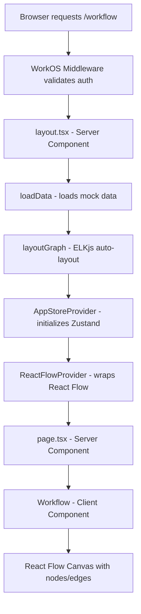

# React Flow Workflow Builder

Complete guide to the React Flow integration in orgOS, a full-featured workflow builder with drag-and-drop, auto-layout, and execution capabilities.

---

## Overview

The `/workflow` route in orgOS provides a complete workflow builder implementation using React Flow (@xyflow/react). This integration demonstrates advanced patterns including:

- Server-side data loading with Next.js 15 App Router
- Client-side state management with Zustand
- Custom node types with interactive handles
- Drag and drop from sidebar
- Auto-layout with ELKjs
- Workflow execution engine
- Theme support with next-themes

**Live Example:** Visit `/workflow` (requires authentication)

---

## Architecture

### High-Level Flow



### Directory Structure

```
src/app/workflow/
├── layout.tsx              # Server layout - data loading & providers
├── page.tsx                # Server page - renders SidebarLayout + Workflow
├── config.ts               # Node type configurations
├── mock-data.ts            # Initial data loader with layoutGraph
├── components/
│   ├── workflow.tsx        # Main React Flow canvas (client)
│   ├── controls.tsx        # Canvas controls (zoom, layout toggle)
│   ├── nodes/
│   │   ├── index.tsx       # Node type registry & factories
│   │   ├── initial-node.tsx
│   │   ├── transform-node.tsx
│   │   ├── branch-node.tsx
│   │   ├── join-node.tsx
│   │   ├── output-node.tsx
│   │   └── workflow-node/
│   │       ├── index.tsx       # Base WorkflowNode component
│   │       └── node-handle.tsx # Custom handle with add button
│   ├── edges/
│   │   └── workflow-edge/
│   │       ├── index.tsx       # Custom edge component
│   │       └── edge-button.tsx # Add node between edges
│   ├── flow-context-menu.tsx
│   ├── flow-dropdown-menu.tsx
│   ├── flow-run-button.tsx
│   └── settings-dialog.tsx
├── hooks/
│   ├── useDragAndDrop.ts       # Drag & drop from sidebar
│   ├── use-layout.tsx          # ELK auto-layout hook
│   └── use-workflow-runner.tsx # Workflow execution engine
├── store/
│   ├── index.tsx           # AppStoreProvider wrapper
│   └── app-store.ts        # Zustand store definition
├── layouts/
│   └── sidebar-layout/
│       ├── index.tsx
│       └── app-sidebar.tsx # Draggable node palette
└── utils/
    ├── layout-helper.ts    # ELKjs integration
    └── icon-mapping.ts     # Lucide icon mapping
```

---

## Getting Started

### Prerequisites

The workflow route requires authentication. Ensure you're logged in via WorkOS:

```typescript
// src/middleware.ts
export default authkitMiddleware({
  middlewareAuth: {
    enabled: true,
    unauthenticatedPaths: ["/"], // /workflow requires auth
  },
});
```

### Accessing the Workflow Builder

1. Navigate to `/workflow` in your browser
2. If not authenticated, you'll be redirected to WorkOS login
3. Once authenticated, the workflow builder loads with initial mock data

---

## Server vs Client Architecture

### Layout (Server Component)

**File:** `/home/akshat/orgos-work/org_os/src/app/workflow/layout.tsx`

```typescript
import { ReactFlowProvider } from '@xyflow/react';
import { AppStoreProvider } from './store';
import { loadData } from './mock-data';

export default async function WorkflowLayout({
  children,
}: {
  children: React.ReactNode;
}) {
  // Load data on server during render
  const { nodes, edges } = await loadData();

  return (
    <AppStoreProvider initialState={{ nodes, edges }}>
      <ReactFlowProvider initialNodes={nodes} initialEdges={edges}>
        {children}
      </ReactFlowProvider>
    </AppStoreProvider>
  );
}
```

**Key Points:**

- Runs on the server (async component)
- Loads initial workflow data via `loadData()`
- Auto-layouts nodes using ELKjs before hydration
- Wraps children with state providers
- Passes initial state to both Zustand and React Flow

### Page (Server Component)

**File:** `/home/akshat/orgos-work/org_os/src/app/workflow/page.tsx`

```typescript
import SidebarLayout from './layouts/sidebar-layout';
import Workflow from './components/workflow';

export const metadata = {
  title: 'Workflow',
  description: 'A Next.js-based React Flow template...',
};

export const dynamic = 'force-dynamic';

export default async function Page() {
  return (
    <SidebarLayout>
      <Workflow />
    </SidebarLayout>
  );
}
```

**Key Points:**

- `force-dynamic` prevents static generation
- Renders layout with sidebar and main canvas
- Minimal logic - composition only

### Workflow Component (Client)

**File:** `/home/akshat/orgos-work/org_os/src/app/workflow/components/workflow.tsx`

```typescript
'use client';

import { ReactFlow, Background, ConnectionLineType } from '@xyflow/react';
import { useTheme } from 'next-themes';
import { useAppStore } from '@/app/workflow/store';
import { nodeTypes } from './nodes';
import { WorkflowEdge } from './edges/workflow-edge';

const edgeTypes = { workflow: WorkflowEdge };
const defaultEdgeOptions = { type: 'workflow' };

export default function Workflow() {
  const store = useAppStore(useShallow(selector));
  const { onDragOver, onDrop } = useDragAndDrop();
  const { resolvedTheme } = useTheme();

  return (
    <ReactFlow
      nodes={store.nodes}
      edges={store.edges}
      onNodesChange={store.onNodesChange}
      onEdgesChange={store.onEdgesChange}
      onConnect={store.onConnect}
      connectionLineType={ConnectionLineType.SmoothStep}
      nodeTypes={nodeTypes}
      edgeTypes={edgeTypes}
      onDragOver={onDragOver}
      onDrop={onDrop}
      colorMode={resolvedTheme}
      defaultEdgeOptions={defaultEdgeOptions}
      fitView
    >
      <Background />
      <WorkflowControls />
      <FlowContextMenu />
      <FlowRunButton />
    </ReactFlow>
  );
}
```

**Key Points:**

- Client component (requires browser APIs)
- Reads state from Zustand store
- Registers custom node and edge types
- Handles drag & drop events
- Syncs with next-themes for light/dark mode

---

## Data Loading & Initialization

### Mock Data Loader

**File:** `/home/akshat/orgos-work/org_os/src/app/workflow/mock-data.ts`

```typescript
import { createEdge } from "./components/edges";
import { createNodeByType } from "./components/nodes";
import { layoutGraph } from "./utils/layout-helper";

const initialNodes = [
  createNodeByType({ type: "initial-node", id: "workflowNode_1" }),
  createNodeByType({ type: "branch-node", id: "workflowNode_2" }),
  createNodeByType({ type: "transform-node", id: "workflowNode_3" }),
  createNodeByType({ type: "output-node", id: "workflowNode_4" }),
  createNodeByType({ type: "output-node", id: "workflowNode_5" }),
];

const initialEdges = [
  createEdge("workflowNode_1", "workflowNode_2"),
  createEdge("workflowNode_2", "workflowNode_3", "true"),
  createEdge("workflowNode_3", "workflowNode_4"),
  createEdge("workflowNode_2", "workflowNode_5", "false"),
];

export async function loadData() {
  const layoutedNodes = await layoutGraph(initialNodes, initialEdges);
  return { nodes: layoutedNodes, edges: initialEdges };
}
```

**Integration Pattern:**

1. `layout.tsx` calls `await loadData()` on server
2. ELKjs calculates optimal node positions
3. Initial state passed to providers
4. Client hydrates with pre-positioned nodes
5. No layout shift on page load

---

## State Management with Zustand

### Store Architecture

**File:** `/home/akshat/orgos-work/org_os/src/app/workflow/store/app-store.ts`

```typescript
import { addEdge, applyEdgeChanges, applyNodeChanges } from "@xyflow/react";
import { create } from "zustand";
import { subscribeWithSelector } from "zustand/middleware";

export type AppState = {
  nodes: AppNode[];
  edges: AppEdge[];
  layout: "fixed" | "free";
  draggedNodes: Map<string, AppNode>;
  connectionSites: Map<string, PotentialConnection>;
  potentialConnection?: PotentialConnection;
};

export type AppActions = {
  toggleLayout: () => void;
  onNodesChange: OnNodesChange<AppNode>;
  setNodes: (nodes: AppNode[]) => void;
  addNode: (node: AppNode) => void;
  removeNode: (nodeId: string) => void;
  addNodeByType: (type: AppNodeType, position: XYPosition) => string | null;
  addNodeInBetween: (params) => void;
  onEdgesChange: OnEdgesChange<AppEdge>;
  onConnect: OnConnect;
  onNodeDragStart: OnNodeDrag<AppNode>;
  onNodeDragStop: OnNodeDrag<AppNode>;
  checkForPotentialConnection: (position, options?) => void;
  resetPotentialConnection: () => void;
};

export function createAppStore(initialState?: Partial<AppState>) {
  return create<AppStore>()(
    subscribeWithSelector((set, get) => ({
      nodes: initialState?.nodes ?? [],
      edges: initialState?.edges ?? [],
      layout: "free",
      draggedNodes: new Map(),
      connectionSites: new Map(),

      onNodesChange: (changes) => {
        const nextNodes = applyNodeChanges(changes, get().nodes);
        set({ nodes: nextNodes });
      },

      addNodeByType: (type, position) => {
        const newNode = createNodeByType({ type, position });
        get().addNode(newNode);
        return newNode.id;
      },

      // ... more actions
    })),
  );
}
```

### Provider Setup

**File:** `/home/akshat/orgos-work/org_os/src/app/workflow/store/index.tsx`

```typescript
'use client';

import { createContext, useContext, useState } from 'react';
import { useStore } from 'zustand';
import { createAppStore } from './app-store';

const AppStoreContext = createContext<AppStoreApi | undefined>(undefined);

export function AppStoreProvider({ children, initialState }) {
  const [store] = useState(() => createAppStore(initialState));
  return <AppStoreContext value={store}>{children}</AppStoreContext>;
}

export function useAppStore<T>(selector: (store: AppStore) => T): T {
  const appStoreContext = useContext(AppStoreContext);
  if (!appStoreContext) {
    throw new Error('useAppStore must be used within AppStoreProvider');
  }
  return useStore(appStoreContext, selector);
}
```

**Usage in Components:**

```typescript
"use client";

import { useShallow } from "zustand/react/shallow";

import { useAppStore } from "@/app/workflow/store";

const selector = (state: AppStore) => ({
  nodes: state.nodes,
  addNode: state.addNode,
  removeNode: state.removeNode,
});

export function MyComponent() {
  const { nodes, addNode, removeNode } = useAppStore(useShallow(selector));
  // Use state...
}
```

---

## Node Types & Configuration

### Node Type Registry

**File:** `/home/akshat/orgos-work/org_os/src/app/workflow/config.ts`

```typescript
import { Position } from "@xyflow/react";

export const NODE_SIZE = { width: 260, height: 50 };

export const nodesConfig: Record<AppNodeType, NodeConfig> = {
  "initial-node": {
    id: "initial-node",
    title: "Initial Node",
    status: "initial",
    handles: [
      {
        type: "source",
        position: Position.Bottom,
        x: NODE_SIZE.width * 0.5,
        y: NODE_SIZE.height,
      },
    ],
    icon: "Rocket",
  },
  "transform-node": {
    id: "transform-node",
    title: "Transform Node",
    handles: [
      {
        type: "source",
        position: Position.Bottom,
        x: NODE_SIZE.width * 0.5,
        y: NODE_SIZE.height,
      },
      {
        type: "target",
        position: Position.Top,
        x: NODE_SIZE.width * 0.5,
        y: 0,
      },
    ],
    icon: "Spline",
  },
  "branch-node": {
    id: "branch-node",
    title: "Branch Node",
    handles: [
      {
        type: "target",
        position: Position.Top,
        x: NODE_SIZE.width * 0.5,
        y: 0,
      },
      {
        id: "true",
        type: "source",
        position: Position.Bottom,
        x: NODE_SIZE.width / 3,
        y: NODE_SIZE.height,
      },
      {
        id: "false",
        type: "source",
        position: Position.Bottom,
        x: NODE_SIZE.width - NODE_SIZE.width / 3,
        y: NODE_SIZE.height,
      },
    ],
    icon: "Merge",
  },
  // join-node and output-node...
};
```

### Available Node Types

1. **Initial Node** - Workflow entry point (1 source handle)
2. **Transform Node** - Data transformation (1 target, 1 source)
3. **Branch Node** - Conditional split (1 target, 2 sources: true/false)
4. **Join Node** - Merge branches (2 targets: true/false, 1 source)
5. **Output Node** - Workflow end point (1 target handle)

### Node Implementation

**File:** `/home/akshat/orgos-work/org_os/src/app/workflow/components/nodes/initial-node.tsx`

```typescript
import { type WorkflowNodeProps } from '.';
import { nodesConfig } from '../../config';
import WorkflowNode from './workflow-node';
import { NodeHandle } from './workflow-node/node-handle';

export function InitialNode({ id, data }: WorkflowNodeProps) {
  return (
    <WorkflowNode id={id} data={data}>
      {nodesConfig['initial-node'].handles.map((handle) => (
        <NodeHandle
          key={`${handle.type}-${handle.id}`}
          id={handle.id}
          type={handle.type}
          position={handle.position}
          x={handle.x}
          y={handle.y}
        />
      ))}
      {/* Custom node content here */}
    </WorkflowNode>
  );
}
```

---

## Custom Components

### Base WorkflowNode

**File:** `/home/akshat/orgos-work/org_os/src/app/workflow/components/nodes/workflow-node/index.tsx`

```typescript
import { Play, Trash } from 'lucide-react';
import { Button } from '@/components/ui/button';
import { BaseNode, BaseNodeHeader, BaseNodeHeaderTitle } from '@/components/base-node';
import { NodeStatusIndicator } from '@/components/node-status-indicator';
import { useWorkflowRunner } from '@/app/workflow/hooks/use-workflow-runner';

function WorkflowNode({ id, data, children }) {
  const { runWorkflow } = useWorkflowRunner();
  const removeNode = useAppStore((s) => s.removeNode);

  const IconComponent = data?.icon ? iconMapping[data.icon] : undefined;

  return (
    <NodeStatusIndicator status={data?.status}>
      <BaseNode style={{ width: 260, height: 50 }}>
        <BaseNodeHeader>
          {IconComponent && <IconComponent aria-label={data?.icon} />}
          <BaseNodeHeaderTitle>{data?.title}</BaseNodeHeaderTitle>
          <Button variant="ghost" onClick={() => runWorkflow(id)}>
            <Play className="stroke-blue-500 fill-blue-500" />
          </Button>
          <Button variant="ghost" onClick={() => removeNode(id)}>
            <Trash />
          </Button>
        </BaseNodeHeader>
        {children}
      </BaseNode>
    </NodeStatusIndicator>
  );
}
```

**Features:**

- Icon from lucide-react via icon-mapping
- Status indicator (initial, loading, success, error)
- Play button to run workflow from this node
- Delete button to remove node
- BaseNode wrapper for consistent styling

### NodeHandle Component

**File:** `/home/akshat/orgos-work/org_os/src/app/workflow/components/nodes/workflow-node/node-handle.tsx`

Custom handle with "+" button to add nodes directly:

```typescript
import { Position, useConnection, useNodeConnections } from '@xyflow/react';
import { Button } from '@/components/ui/button';
import { ButtonHandle } from '@/components/button-handle';
import { FlowDropdownMenu } from '@/app/workflow/components/flow-dropdown-menu';

export function NodeHandle({ type, position, id, x, y }) {
  const connections = useNodeConnections({ handleType: type, handleId: id });
  const isConnectionInProgress = useConnection((c) => c.inProgress);
  const { isOpen, toggleDropdown } = useDropdown();
  const { addNodeInBetween } = useAppStore();

  const displayAddButton = connections.length === 0 && !isConnectionInProgress;

  const onAddNode = (nodeType: AppNodeType) => {
    addNodeInBetween({
      type: nodeType,
      [type]: nodeId,
      [`${type}HandleId`]: id,
      position: getIndicatorPosition(nodePosition, x, y, type),
    });
    toggleDropdown();
  };

  return (
    <ButtonHandle
      type={type}
      position={position}
      id={id}
      style={{ transform: `translate(${x}px, ${y}px)` }}
      showButton={displayAddButton}
    >
      <Button onClick={toggleDropdown} size="icon" variant="secondary">
        +
      </Button>
      {isOpen && (
        <FlowDropdownMenu
          onAddNode={onAddNode}
          filterNodes={compatibleNodeTypes(type)}
        />
      )}
    </ButtonHandle>
  );
}
```

**Features:**

- Shows "+" button when handle is empty
- Opens dropdown menu with compatible node types
- Automatically connects new node between existing ones
- Hides during active connection (prevents UI clutter)

### WorkflowEdge Component

**File:** `/home/akshat/orgos-work/org_os/src/app/workflow/components/edges/workflow-edge/index.tsx`

```typescript
import { BaseEdge, getBezierPath, type EdgeProps } from '@xyflow/react';
import { EdgeButton } from './edge-button';

export function WorkflowEdge({
  id, sourceX, sourceY, targetX, targetY,
  sourcePosition, targetPosition, source, target,
  sourceHandleId, style, markerEnd,
}: EdgeProps<AppEdge>) {
  const [edgePath, labelX, labelY] = getBezierPath({
    sourceX, sourceY, sourcePosition,
    targetX, targetY, targetPosition,
  });

  return (
    <>
      <BaseEdge
        id={id}
        path={edgePath}
        markerEnd={markerEnd}
        style={{ ...style, pointerEvents: 'auto' }}
      />
      <EdgeButton
        id={id}
        x={labelX}
        y={labelY}
        source={source}
        target={target}
        sourceHandleId={sourceHandleId}
      />
    </>
  );
}
```

**Features:**

- Bezier curve path for smooth connections
- EdgeButton at midpoint to insert nodes
- Custom styling support
- Pointer events enabled for interaction

---

## Drag and Drop from Sidebar

### Sidebar Implementation

**File:** `/home/akshat/orgos-work/org_os/src/app/workflow/layouts/sidebar-layout/app-sidebar.tsx`

```typescript
'use client';

import { useState, useCallback } from 'react';
import { useReactFlow } from '@xyflow/react';
import { SidebarMenuItem, SidebarMenuButton } from '@/components/ui/sidebar';
import { nodesConfig } from '../../config';

function DraggableItem(props: NodeConfig) {
  const { screenToFlowPosition } = useReactFlow();
  const { addNode, checkForPotentialConnection } = useAppStore();
  const [isDragging, setIsDragging] = useState(false);

  const onDragStart = (e: React.DragEvent) => {
    e.dataTransfer.setData('application/reactflow', JSON.stringify(props));
    setIsDragging(true);
  };

  const onDrag = (e: React.DragEvent) => {
    const flowPosition = screenToFlowPosition({ x: e.clientX, y: e.clientY });
    checkForPotentialConnection(flowPosition);
  };

  return (
    <SidebarMenuItem
      draggable
      onDragStart={onDragStart}
      onDrag={onDrag}
      onDragEnd={() => setIsDragging(false)}
    >
      <SidebarMenuButton>
        <IconComponent />
        <span>{props.title}</span>
      </SidebarMenuButton>
    </SidebarMenuItem>
  );
}
```

### Drop Handler

**File:** `/home/akshat/orgos-work/org_os/src/app/workflow/hooks/useDragAndDrop.ts`

```typescript
import { useCallback } from "react";

import { useReactFlow } from "@xyflow/react";

import { useAppStore } from "@/app/workflow/store";

export function useDragAndDrop() {
  const { screenToFlowPosition } = useReactFlow();
  const { addNode, addNodeInBetween, potentialConnection } = useAppStore();

  const onDrop = useCallback(
    (event: React.DragEvent) => {
      const nodeProps = JSON.parse(
        event.dataTransfer.getData("application/reactflow"),
      );

      if (potentialConnection) {
        // Insert node between two connected nodes
        addNodeInBetween({
          type: nodeProps.id,
          source: potentialConnection.source?.node,
          target: potentialConnection.target?.node,
          sourceHandleId: potentialConnection.source?.handle,
          targetHandleId: potentialConnection.target?.handle,
          position: potentialConnection.position,
        });
      } else {
        // Add node at drop position
        const position = screenToFlowPosition({
          x: event.clientX,
          y: event.clientY,
        });
        const newNode = createNodeByType({ type: nodeProps.id, position });
        addNode(newNode);
      }
    },
    [addNode, addNodeInBetween, potentialConnection],
  );

  const onDragOver = useCallback((event: React.DragEvent) => {
    event.preventDefault();
  }, []);

  return { onDrop, onDragOver };
}
```

**Smart Drop Behavior:**

1. **Drop on empty canvas** - Adds node at cursor position
2. **Drop near handle** - Connects to that handle automatically
3. **Drop near edge** - Inserts node between connected nodes

---

## Auto-Layout with ELKjs

### Layout Helper

**File:** `/home/akshat/orgos-work/org_os/src/app/workflow/utils/layout-helper.ts`

```typescript
import ELK, { type ElkNode } from "elkjs/lib/elk.bundled.js";

import { nodesConfig } from "../config";

const layoutOptions = {
  "elk.algorithm": "layered",
  "elk.direction": "DOWN",
  "elk.layered.spacing.edgeNodeBetweenLayers": "80",
  "elk.spacing.nodeNode": "150",
  "elk.layered.nodePlacement.strategy": "SIMPLE",
};

export async function layoutGraph(nodes: AppNode[], edges: Edge[]) {
  const elk = new ELK();

  const graph: ElkNode = {
    id: "root",
    layoutOptions,
    edges: edges.map((edge) => ({
      id: edge.id,
      sources: [
        edge.sourceHandle
          ? `${edge.source}-source-${edge.sourceHandle}`
          : edge.source,
      ],
      targets: [
        edge.targetHandle
          ? `${edge.target}-target-${edge.targetHandle}`
          : edge.target,
      ],
    })),
    children: nodes.map((node) => {
      const { targetPorts, sourcePorts } = getPorts(node);
      return {
        id: node.id,
        width: node.width ?? node.measured?.width ?? 150,
        height: node.height ?? node.measured?.height ?? 50,
        ports: [...targetPorts, ...sourcePorts],
        layoutOptions: { "org.eclipse.elk.portConstraints": "FIXED_ORDER" },
      };
    }),
  };

  const elkNodes = await elk.layout(graph);

  return nodes.map((node) => {
    const layoutedNode = elkNodes.children?.find((n) => n.id === node.id);
    if (layoutedNode?.x && layoutedNode?.y) {
      return { ...node, position: { x: layoutedNode.x, y: layoutedNode.y } };
    }
    return node;
  });
}
```

**When Layout Runs:**

1. **Initial load** - `loadData()` in layout.tsx
2. **Layout toggle** - User clicks layout button in controls
3. **Node dimensions change** - Automatic re-layout in fixed mode

### Layout Toggle

Users can toggle between:

- **Free mode** - Manual positioning, drag anywhere
- **Fixed mode** - Auto-layout on dimension changes

```typescript
// In app-store.ts
toggleLayout: () =>
  set(state => ({
    layout: state.layout === 'fixed' ? 'free' : 'fixed',
  })),

onNodesChange: (changes) => {
  const nextNodes = applyNodeChanges(changes, get().nodes);

  if (get().layout === 'fixed' &&
      changes.some(change => change.type === 'dimensions')) {
    void layoutGraph(nextNodes, get().edges).then(layoutedNodes => {
      set({ nodes: layoutedNodes });
    });
  } else {
    set({ nodes: nextNodes });
  }
},
```

---

## Workflow Runner

### Execution Engine

**File:** `/home/akshat/orgos-work/org_os/src/app/workflow/hooks/use-workflow-runner.tsx`

```typescript
"use client";

import { useCallback, useRef, useState } from "react";

import { useAppStore } from "@/app/workflow/store";

export function useWorkflowRunner() {
  const [logMessages, setLogMessages] = useState<string[]>([]);
  const isRunning = useRef(false);
  const { getNodes, setNodes, getEdges } = useAppStore();

  const updateNodeStatus = useCallback(
    (nodeId: string, status: string) => {
      setNodes(
        getNodes().map((node) =>
          node.id === nodeId
            ? { ...node, data: { ...node.data, status } }
            : node,
        ),
      );
    },
    [setNodes, getNodes],
  );

  const processNode = useCallback(
    async (node: AppNode) => {
      updateNodeStatus(node.id, "loading");
      setLogMessages((prev) => [...prev, `${node.data.title} processing...`]);

      await new Promise((resolve) => setTimeout(resolve, 2000));

      if (!isRunning.current) {
        resetNodeStatus();
        return;
      }

      updateNodeStatus(node.id, "success");
    },
    [updateNodeStatus],
  );

  const runWorkflow = useCallback(
    async (startNodeId?: string) => {
      if (isRunning.current) return;

      const nodes = getNodes();
      const edges = getEdges();
      isRunning.current = true;

      const _startNodeId =
        startNodeId ||
        nodes.find((node) => !edges.some((e) => e.target === node.id))?.id;

      if (!_startNodeId) return;

      setLogMessages(["Starting workflow..."]);

      const nodesToProcess = collectNodesToProcess(nodes, edges, _startNodeId);

      for (const node of nodesToProcess) {
        if (!isRunning.current) break;
        await processNode(node);
      }

      setLogMessages((prev) => [...prev, "Workflow processing complete."]);
      isRunning.current = false;
    },
    [getNodes, getEdges, processNode],
  );

  return {
    logMessages,
    runWorkflow,
    stopWorkflow,
    isRunning: isRunning.current,
  };
}
```

**Features:**

- **Graph traversal** - Visits nodes in dependency order
- **Status updates** - Visual feedback (loading, success, error)
- **Logging** - Messages displayed in UI
- **Cancellation** - Stop button to halt execution
- **Customizable** - Replace `processNode` with real logic

**Execution Triggers:**

1. Click Play button on any node (starts from that node)
2. Click "Run Workflow" button (starts from initial node)

---

## Theme Support

### Dark Mode Integration

**File:** `/home/akshat/orgos-work/org_os/src/app/workflow/components/workflow.tsx`

```typescript
'use client';

import { useTheme } from 'next-themes';
import { useState, useEffect } from 'react';
import { ReactFlow, type ColorMode } from '@xyflow/react';

export default function Workflow() {
  const { theme, resolvedTheme } = useTheme();
  const [mounted, setMounted] = useState(false);

  // Avoid hydration mismatch
  useEffect(() => {
    setMounted(true);
  }, []);

  const colorMode = mounted ? (resolvedTheme as ColorMode) : 'light';

  return (
    <ReactFlow
      colorMode={colorMode}
      // ... other props
    >
      <Background />
    </ReactFlow>
  );
}
```

**Why this pattern?**

- next-themes uses localStorage (client-only)
- Server renders with unknown theme
- Wait for client mount to avoid mismatch
- Default to light mode during hydration

---

## CSS Layer Strategy

### Global Styles

**File:** `/home/akshat/orgos-work/org_os/src/styles/globals.css`

```css
@import "@xyflow/react/dist/style.css" layer(base);
@import "tailwindcss";
```

**Why `layer(base)`?**

React Flow styles must load before Tailwind utilities to allow overrides:

```css
/* React Flow styles in base layer */
.react-flow__node {
  /* Default styles */
}

/* Tailwind utilities can override */
.react-flow__node.selected {
  @apply border-muted-foreground shadow-lg;
}
```

**Custom Overrides:**

```css
/* In component or globals.css */
.react-flow__node {
  @apply bg-card rounded-md border;
}

.react-flow__edge-path {
  @apply stroke-primary;
}

.react-flow__handle {
  @apply bg-primary;
}
```

---

## Authentication Requirement

### WorkOS Middleware Protection

**File:** `/home/akshat/orgos-work/org_os/src/middleware.ts`

```typescript
import { authkitMiddleware } from "@workos-inc/authkit-nextjs";

export default authkitMiddleware({
  middlewareAuth: {
    enabled: true,
    unauthenticatedPaths: ["/"], // /workflow requires auth
  },
});

export const config = {
  matcher: ["/((?!_next/static|_next/image|favicon.ico|docs).*)"],
};
```

**How it works:**

1. User visits `/workflow`
2. Middleware intercepts request
3. Checks for WorkOS session
4. If authenticated: proceeds to page
5. If not authenticated: redirects to login

**No manual auth checks needed** - middleware handles it automatically!

---

## Type Safety

### Typed Nodes and Edges

**File:** `/home/akshat/orgos-work/org_os/src/app/workflow/components/nodes/index.tsx`

```typescript
import { type Node } from "@xyflow/react";

export type WorkflowNodeData = {
  title?: string;
  label?: string;
  icon?: keyof typeof iconMapping;
  status?: "loading" | "success" | "error" | "initial";
};

export type AppNode =
  | Node<WorkflowNodeData, "initial-node">
  | Node<WorkflowNodeData, "transform-node">
  | Node<WorkflowNodeData, "join-node">
  | Node<WorkflowNodeData, "branch-node">
  | Node<WorkflowNodeData, "output-node">;

export type AppNodeType = NonNullable<AppNode["type"]>;
```

**Benefits:**

- Full autocomplete for node types
- Type-safe node data access
- Compile-time error checking
- Better refactoring support

---

## Customization Guide

### Adding a New Node Type

1. **Define configuration** in `config.ts`:

```typescript
export const nodesConfig = {
  // ... existing types
  "custom-node": {
    id: "custom-node",
    title: "Custom Node",
    handles: [
      { type: "target", position: Position.Top, x: 130, y: 0 },
      { type: "source", position: Position.Bottom, x: 130, y: 50 },
    ],
    icon: "Sparkles",
  },
};
```

2. **Create component** in `components/nodes/custom-node.tsx`:

```typescript
import { type WorkflowNodeProps } from '.';
import { nodesConfig } from '../../config';
import WorkflowNode from './workflow-node';
import { NodeHandle } from './workflow-node/node-handle';

export function CustomNode({ id, data }: WorkflowNodeProps) {
  return (
    <WorkflowNode id={id} data={data}>
      {nodesConfig['custom-node'].handles.map((handle) => (
        <NodeHandle
          key={`${handle.type}-${handle.id}`}
          id={handle.id}
          type={handle.type}
          position={handle.position}
          x={handle.x}
          y={handle.y}
        />
      ))}
      {/* Your custom UI here */}
    </WorkflowNode>
  );
}
```

3. **Register in index.tsx**:

```typescript
export const nodeTypes = {
  "initial-node": InitialNode,
  "transform-node": TransformNode,
  "branch-node": BranchNode,
  "join-node": JoinNode,
  "output-node": OutputNode,
  "custom-node": CustomNode, // Add here
};
```

4. **Update type union**:

```typescript
export type AppNode =
  | Node<WorkflowNodeData, "initial-node">
  | Node<WorkflowNodeData, "transform-node">
  | Node<WorkflowNodeData, "join-node">
  | Node<WorkflowNodeData, "branch-node">
  | Node<WorkflowNodeData, "output-node">
  | Node<WorkflowNodeData, "custom-node">; // Add here
```

### Persisting Workflows

Replace `mock-data.ts` with database integration:

```typescript
// src/app/workflow/layout.tsx
import { api } from "@/trpc/server";

export default async function WorkflowLayout({ children }) {
  // Fetch from database instead of mock data
  const workflow = await api.workflow.get({ id: workflowId });
  const layoutedNodes = await layoutGraph(workflow.nodes, workflow.edges);

  return (
    <AppStoreProvider initialState={{ nodes: layoutedNodes, edges: workflow.edges }}>
      <ReactFlowProvider initialNodes={layoutedNodes} initialEdges={workflow.edges}>
        {children}
      </ReactFlowProvider>
    </AppStoreProvider>
  );
}
```

**Auto-save with Zustand subscription:**

```typescript
// In layout.tsx or separate file
"use client";

import { useEffect } from "react";

import { useAppStore } from "@/app/workflow/store";
import { api } from "@/trpc/react";

// In layout.tsx or separate file

export function WorkflowAutoSave({ workflowId }: { workflowId: string }) {
  const saveWorkflow = api.workflow.save.useMutation();

  useEffect(() => {
    const unsubscribe = useAppStore.subscribe(
      (state) => ({ nodes: state.nodes, edges: state.edges }),
      ({ nodes, edges }) => {
        // Debounce in production
        saveWorkflow.mutate({ workflowId, nodes, edges });
      },
      { equalityFn: shallow },
    );

    return unsubscribe;
  }, [workflowId]);

  return null;
}
```

### Custom Workflow Runner

Replace the demo runner with real execution logic:

```typescript
const processNode = useCallback(
  async (node: AppNode) => {
    updateNodeStatus(node.id, "loading");

    try {
      // Call your API endpoint
      const result = await fetch("/api/execute-node", {
        method: "POST",
        body: JSON.stringify({
          nodeId: node.id,
          nodeType: node.type,
          nodeData: node.data,
        }),
      });

      const data = await result.json();

      if (data.success) {
        updateNodeStatus(node.id, "success");
      } else {
        updateNodeStatus(node.id, "error");
      }
    } catch (error) {
      updateNodeStatus(node.id, "error");
      setLogMessages((prev) => [...prev, `Error: ${error.message}`]);
    }
  },
  [updateNodeStatus],
);
```

---

## Best Practices

### Performance Optimization

1. **Memoize selectors** with `useShallow`:

```typescript
import { useShallow } from "zustand/react/shallow";

const selector = (state: AppStore) => ({
  nodes: state.nodes,
  addNode: state.addNode,
});

const { nodes, addNode } = useAppStore(useShallow(selector));
```

2. **Minimize re-renders** by selecting only needed state:

```typescript
// Bad - re-renders on any state change
const store = useAppStore((state) => state);

// Good - re-renders only when nodes change
const nodes = useAppStore((state) => state.nodes);
```

3. **Use React.memo** for expensive node components:

```typescript
export const CustomNode = memo(({ id, data }: WorkflowNodeProps) => {
  // Expensive rendering logic
});
```

### State Management

1. **Keep Zustand as single source of truth** for workflow state
2. **Use React Flow's built-in state** only for UI interactions (selection, viewport)
3. **Sync state carefully** when updating both stores

### Accessibility

1. **Keyboard navigation** - React Flow provides built-in support
2. **ARIA labels** - Add to custom buttons and controls
3. **Focus management** - Ensure keyboard users can access all features

```typescript
<Button
  onClick={onRemove}
  aria-label={`Delete ${data.title}`}
>
  <Trash />
</Button>
```

---

## Troubleshooting

### Hydration Mismatch with Theme

**Problem:** "Hydration failed because the initial UI does not match"

**Solution:** Wait for client mount before using theme:

```typescript
const [mounted, setMounted] = useState(false);

useEffect(() => {
  setMounted(true);
}, []);

const colorMode = mounted ? (resolvedTheme as ColorMode) : "light";
```

### Nodes Not Appearing

**Problem:** Nodes array is empty or not rendering

**Checklist:**

1. Verify `loadData()` is called in layout.tsx
2. Check initial state is passed to providers
3. Ensure node types are registered in `nodeTypes` object
4. Verify node dimensions are set (width/height or measured)

### Layout Issues

**Problem:** Nodes overlap or have incorrect positions

**Solutions:**

1. Ensure ELKjs runs before hydration: `await layoutGraph(nodes, edges)`
2. Check node dimensions are accurate
3. Verify handles have correct positions in config
4. Use `fitView` prop on ReactFlow for initial zoom

### Drag and Drop Not Working

**Problem:** Cannot drag nodes from sidebar to canvas

**Checklist:**

1. Verify `onDragOver` and `onDrop` are passed to ReactFlow
2. Check `draggable` attribute on sidebar items
3. Ensure `screenToFlowPosition` is used for coordinate conversion
4. Verify `createNodeByType` returns valid node

---

## Resources

- [React Flow Documentation](https://reactflow.dev)
- [React Flow TypeScript Guide](https://reactflow.dev/learn/advanced-use/typescript)
- [ELKjs Documentation](https://eclipse.dev/elk/)
- [Zustand Documentation](https://zustand-demo.pmnd.rs/)
- [next-themes](https://github.com/pacocoursey/next-themes)
- [WorkOS AuthKit](https://workos.com/docs/authkit)

---

## Next Steps

1. **Persist workflows** - Add database integration with Prisma
2. **Real execution** - Implement actual node processing logic
3. **Validation** - Add schema validation with Zod
4. **Undo/Redo** - Implement history tracking
5. **Export/Import** - JSON export and import functionality
6. **Templates** - Pre-built workflow templates
7. **Collaboration** - Real-time multi-user editing with WebSockets
